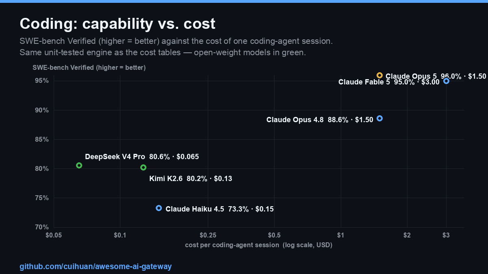

<!-- 本文件的成本表由 scripts/cost_calc.py 从 data/models.json 生成，请勿手改 COST 标记之间的内容。 -->
# AI 网关与模型评测集 📊

> 为 [Awesome AI Gateway](README.zh-CN.md) 提供一层专业、可复现的评测：网关背后的**模型**到底有多强、在具体任务上**真实花多少钱**，以及**网关本身**在合规/价格/安全/稳定/可观测五个维度的评分。
>
> **语言：** [English](BENCHMARKS.md) · 简体中文 · 最近审阅见页脚

这里每个数字都**标注来源与日期**。成本单元格由一个带单测的脚本（[`scripts/cost_calc.py`](scripts/cost_calc.py)）从公开价格表**计算**得出，绝非手填——重跑一遍结果一致。模型分数摘自一手榜单并附链接。网关评分遵循下方公开的[评分标准](#评分标准统一执行)。

## 目录

- [第一部分 — 权威模型基准](#第一部分--权威模型基准)
- [第二部分 — 按场景选模型](#第二部分--按场景选模型)
- [第三部分 — 真实 Token 成本实测（脚本计算）](#第三部分--真实-token-成本实测脚本计算)
- [第四部分 — 网关五维评分：合规·价格·安全·稳定·可观测](#第四部分--网关五维评分合规价格安全稳定可观测)
- [第五部分 — 真实评测：生产环境里用户怎么说](#第五部分--真实评测生产环境里用户怎么说)
- [第六部分 — 网关可观测性：真正该看的因素](#第六部分--网关可观测性真正该看的因素)
- [第七部分 — 身份与治理：SSO 税对照表](#第七部分--身份与治理sso-税对照表)
- [方法论与注意事项](#方法论与注意事项)
- [数据来源](#数据来源)

---

## 第一部分 — 权威模型基准

模型有多强？以下是审阅日最被引用的公开基准。**务必结合[注意事项](#方法论与注意事项)阅读**——榜单会被刷分和数据污染，请与人类盲评（Arena）和下面的真实成本表交叉验证。

按 **Artificial Analysis 智能指数**（最常被引用的综合分）排序，采用当前 **v4.1** 口径（2026-06-15 重定标、加重 Agent 任务权重——分数普遍比 v4.0 低约 5 分，**绝不可跨口径比较**）。每列刻意单一来源：GPQA♦ 与 HLE 为 AA 独立复测；SWE-bench Verified 取独立的 [BenchLM](https://benchlm.ai/benchmarks/sweVerified) 榜（榜单日期 2026-07-27）——厂商模型卡自报分数但独立榜未收录时，显示 `—` 而非厂商数字。推理模型按其最高推理档展示（AA 头条口径）。`♦` = GPQA Diamond。

| # | 模型 | 厂商 | 权重 | 上下文 | GPQA♦ | SWE-bench Verified | HLE | Arena Elo | AA 指数 |
|---|---|---|---|---|---|---|---|---|---|
| 1 | **Claude Opus 5** | Anthropic | 闭源 | 1M | 93.2% | **96.0%** 🥇 | 52.6% | 1495ˢ | **60.7** 🥇 |
| 2 | **Claude Fable 5** | Anthropic | 闭源 | 1M | 92.6% | 95.0% | **53.3%** 🥇 | **1508** 🥇 | **59.9** |
| 3 | **GPT-5.6 Sol** | OpenAI | 闭源 | ~1M | 94.1% | — | 47.2% | 1485 | **58.9** |
| 4 | **Kimi K3** | 月之暗面 | 🔓 开源 | 1M | 93.5% | — | 44.4% | 1486ˢ | **57.1** |
| 5 | **Claude Opus 4.8** | Anthropic | 闭源 | 1M | 92.0% | 88.6% | 45.7% | 1484 | **55.7** |
| 6 | **GPT-5.5** | OpenAI | 闭源 | ~1M | 93.5% | — | 44.3% | 1482 | **54.8** |
| 7 | **Grok 4.5** | xAI | 闭源 | 500K | 93.1% | — | 40.3% | 1468 | **53.8** |
| 8 | **GLM-5.2** | 智谱 Z.ai | 🔓 开源·MIT | 1M | 89.5% | — | 40.1% | 1469 | **51.1** |
| 9 | **Muse Spark 1.1** | Meta | 闭源 | 262K | 89.8% | — | 45.1% | 1491 | **50.6** |
| 10 | **Gemini 3.5 Flash** | Google | 闭源 | 1M | 92.2% | — | 41.0% | 1476 | **50.2** |
| 11 | **Gemini 3.6 Flash** | Google | 闭源 | 1M | 92.8% | — | 38.3% | 1482 | **50.1** |
| 12 | **Gemini 3.1 Pro** | Google | 闭源 | 1M | 94.1% | — | 44.7% | 1486 | **46.5** |
| 13 | **Qwen3.7 Max** | 阿里 | 闭源 | 1M | 92.3% | 80.4%⁴ | 38.1% | 1475 | **46.0** |
| 14 | **DeepSeek V4 Pro** | 深度求索 | 🔓 开源·MIT | 1M | 88.8% | 80.6% | 35.9% | 1457 | **44.3** |
| 15 | **Kimi K2.6** | 月之暗面 | 🔓 开源 | 256K | 91.1% | 80.2% | 35.9% | 1461 | **44.2** |
| 16 | **GLM-5.1** | 智谱 Z.ai | 🔓 开源 | 200K | 86.8% | — | 28.0% | 1469 | **40.2** |
| 17 | **Grok 4.3** | xAI | 闭源 | 1M | 90.1% | — | 35.0% | 1443 | **37.6** |
| 18 | **Claude Haiku 4.5** | Anthropic | 闭源 | 200K | 67.2% | 73.3% | 9.7% | 1412 | **29.6** |
| 19 | **Mistral Large 3** | Mistral | 🔓 开源 | 256K | 68.0% | — | 4.1% | 1415 | **15.9** |

ˢ Arena Elo 尚未稳定——Claude Opus 5 仅约 2,400 票（±12）、Kimi K3 约 3,600 票；这两行按临时值看待。Fable 5 的 1508（±6，1.6 万票）已稳定。
⁴ BenchLM 将 Qwen3.7 Max（及 Pro 榜的 Gemini 3.5 Flash）行标记为较低置信度。

> 🛡️ **抗污染交叉验证。** 在更难刷分的 **SWE-bench Pro** 上（[BenchLM](https://benchlm.ai/benchmarks/swePro)）：Fable 5 **80.0%** 🥇 · Opus 5 79.2% · Opus 4.8 69.2% · Grok 4.5 64.7% · GPT-5.6 Sol 64.6% · GLM-5.2 62.1% · Muse Spark 1.1 61.5% · GPT-5.5 / Kimi K2.6 58.6% · GLM-5.1 58.4%。（限量供应的 Claude Mythos 5 为 80.3%——常被误记到 Fable 5 头上的正是这个数字。）前沿模型在 GPQA 上已挤在 89–94%——这个天花板下 1–2 分的差距属于噪声；**真正还能拉开差距的是 HLE**（4–53% 的跨度）。

**各列含义**
- **GPQA Diamond** — 研究生级科学题，设计上"搜不到答案"（AA 独立复测）。
- **SWE-bench Verified** — 修复真实 GitHub issue；最具代表性的*智能体编码*分（BenchLM 独立复测）。
- **HLE（Humanity's Last Exam）** — 前沿难度闭卷考试；目前区分度最强的一列（AA 独立复测）。
- **Arena Elo** — [Arena（原 LMArena）](https://arena.ai/leaderboard) 上的盲测人类偏好；最难刷的指标。
- **AA 指数** — [Artificial Analysis](https://artificialanalysis.ai) 智能指数 v4.1，跨智能体/编码/推理/知识的综合分。
- AIME 数学分（如有官方发布）保留在 [`data/models.json`](data/models.json)；因覆盖太稀，此表撤下该列。

---

## 第二部分 — 按场景选模型

基准衡量的是抽象能力，但大多数团队只有一个具体任务。下表把常见任务映射到*能力之选*和*性价比之选*（够用、便宜得多）。价格请对照[第三部分](#第三部分--真实-token-成本实测脚本计算)。

| 你的任务 | 🏆 能力之选 | 💸 性价比之选（够用又便宜） | 原因 |
|---|---|---|---|
| **智能体编码**（SWE-bench） | Claude Opus 5（96.0）/ Fable 5 | Kimi K2.6 · DeepSeek V4 Pro | 开源模型以零头成本达到 ~80% SWE-bench Verified |
| **长上下文 / RAG**（10 万+） | Gemini 3.1 Pro（1M 上下文） | DeepSeek V4-Flash（1M 上下文） | 输入密集任务的成本地板；注意 Gemini >20 万的加价 |
| **硬核推理 / 数学** | Gemini 3.1 Pro（98.2 AIME'26） | GLM-5.1 · Kimi K2.6 | 开源模型 AIME 已达 95%+——数学是最被"平民化"的前沿能力 |
| **批量生成**（邮件、内容） | Claude Haiku 4.5 | DeepSeek V4-Flash · GPT-5.4 nano | 输出密集→输出价格主导，见 [3.1](#31-写一封-10-万-token-的报告输出密集) |
| **最便宜的可用对话** | GPT-5.4 nano | DeepSeek V4-Flash | 百万 token 月成本约 $0.21，GPT-5.5 要 $17.50 |
| **开放式对话**（人类偏好） | Claude Fable 5（Arena 1508，第 1）· Muse Spark 1.1 | GLM-5.2（1469，输入 $1.40/M） | Arena Elo 是最贴合"用着舒服"的指标 |
| **私有化 / 数据主权** | Kimi K3 · DeepSeek V4 Pro（MIT） | GLM-5.2（MIT）· Kimi K2.6 | 开源权重可跑在自己 VPC 内——零数据出境 |
| **强合规企业** | Claude Opus 4.8 / GPT-5.5 经 Azure / Bedrock / Vertex | — | 让旗舰模型走[原厂云](#第四部分--网关五维评分合规价格安全稳定可观测)，拿 HIPAA/FedRAMP |

> **网关**正是让你无需改代码就能落地上表的东西：把能力之选设为主、性价比之选设为兜底，或按任务逐请求路由。这就是这份[清单](README.zh-CN.md)的意义。

---

## 第三部分 — 真实 Token 成本实测（脚本计算）

> "基准告诉你哪个*最强*，账单告诉你哪个*用得起*。" 下面四个具体任务的成本，由 [`scripts/cost_calc.py`](scripts/cost_calc.py) 从 [`data/models.json`](data/models.json) 的价格计算得出。价格单位为美元/百万 token；推理模型的隐藏思考 token 按输出价计费。

### 3.1 写一封 10 万 token 的报告（输出密集）

<!-- COST:email:START -->
**写一封 10 万 token 的报告** (输入 2,000 tok · 输出 100,000 tok)

| # | 模型 | 厂商 | 成本 |
|---|---|---|---|
| 1 | DeepSeek V4-Flash | DeepSeek | $0.028 |
| 2 | GPT-5.4 nano | OpenAI | $0.13 |
| 3 | Mistral Large 3 | Mistral | $0.15 |
| 4 | Kimi K2.6 | Moonshot | $0.40 |
| 5 | GLM-5.2 | Z.ai (Zhipu) | $0.44 |
| 6 | Claude Haiku 4.5 | Anthropic | $0.50 |
| 7 | Grok 4.5 | xAI | $0.60 |
| 8 | Gemini 3.6 Flash | Google | $0.75 |
| 9 | Gemini 3.1 Pro | Google | $1.20 |
| 10 | Kimi K3 | Moonshot | $1.51 |
| 11 | Claude Opus 5 | Anthropic | $2.51 |
| 12 | Claude Opus 4.8 | Anthropic | $2.51 |
| 13 | GPT-5.6 Sol | OpenAI | $3.01 |
| 14 | GPT-5.5 | OpenAI | $3.01 |

> 📊 最便宜的比最贵的低约 **106×**。
<!-- COST:email:END -->

### 3.2 总结一份 10 万 token 的文档（输入密集）

<!-- COST:summarize:START -->
**总结一份 10 万 token 的文档** (输入 100,000 tok · 输出 2,000 tok)

| # | 模型 | 厂商 | 成本 |
|---|---|---|---|
| 1 | DeepSeek V4-Flash | DeepSeek | $0.015 |
| 2 | GPT-5.4 nano | OpenAI | $0.023 |
| 3 | Mistral Large 3 | Mistral | $0.053 |
| 4 | Kimi K2.6 | Moonshot | $0.10 |
| 5 | Claude Haiku 4.5 | Anthropic | $0.11 |
| 6 | GLM-5.2 | Z.ai (Zhipu) | $0.15 |
| 7 | Gemini 3.6 Flash | Google | $0.17 |
| 8 | Grok 4.5 | xAI | $0.21 |
| 9 | Gemini 3.1 Pro | Google | $0.22 |
| 10 | Kimi K3 | Moonshot | $0.33 |
| 11 | Claude Opus 5 | Anthropic | $0.55 |
| 12 | Claude Opus 4.8 | Anthropic | $0.55 |
| 13 | GPT-5.6 Sol | OpenAI | $0.56 |
| 14 | GPT-5.5 | OpenAI | $0.56 |

> 📊 最便宜的比最贵的低约 **38×**。
<!-- COST:summarize:END -->

### 3.3 编码 Agent 会话（混合 + 推理 token）

  

> **能力与成本放在同一张图上。** 图中是所有"同时有独立 SWE-bench Verified 分数（BenchLM）和价格"的模型，统一按编码 Agent 会话计价。开源模型（绿色）拿到约 80%——旗舰**级**编码能力——花费却只是零头：**DeepSeek V4 Pro（80.6%）单次会话约 $0.07**，而 96% 的天花板（Claude Opus 5）要贵约 23×、Arena 榜首的 Fable 5 约 46×。成本轴复用下方带单测的引擎计算，能力轴取自带日期的 `swe_bench_verified`（无独立分数的模型不入图——如 BenchLM 榜上缺席的 Gemini 3.1 Pro）。由 [`scripts/make_coding_chart.py`](scripts/make_coding_chart.py) 渲染——重跑一次得到同一张图。

<!-- COST:coding:START -->
**编码 Agent 会话** (输入 50,000 tok · 输出 20,000 tok · 推理模型另计 30,000 思考 token)

| # | 模型 | 厂商 | 成本 |
|---|---|---|---|
| 1 | DeepSeek V4-Flash | DeepSeek | $0.021 |
| 2 | Mistral Large 3 | Mistral | $0.055 |
| 3 | GPT-5.4 nano | OpenAI | $0.073 |
| 4 | Kimi K2.6 | Moonshot | $0.13 |
| 5 | Claude Haiku 4.5 | Anthropic | $0.15 |
| 6 | GLM-5.2 | Z.ai (Zhipu) | $0.29 |
| 7 | Grok 4.5 | xAI | $0.40 |
| 8 | Gemini 3.6 Flash | Google | $0.45 |
| 9 | Gemini 3.1 Pro | Google | $0.70 |
| 10 | Kimi K3 | Moonshot | $0.90 |
| 11 | Claude Opus 5 | Anthropic | $1.50 |
| 12 | Claude Opus 4.8 | Anthropic | $1.50 |
| 13 | GPT-5.6 Sol | OpenAI | $1.75 |
| 14 | GPT-5.5 | OpenAI | $1.75 |

> 📊 最便宜的比最贵的低约 **83×**。
<!-- COST:coding:END -->

### 3.4 百万 token 的聊天机器人月度（均衡）

<!-- COST:chatbot:START -->
**百万 token 聊天机器人月度** (输入 500,000 tok · 输出 500,000 tok)

| # | 模型 | 厂商 | 成本 |
|---|---|---|---|
| 1 | DeepSeek V4-Flash | DeepSeek | $0.21 |
| 2 | GPT-5.4 nano | OpenAI | $0.72 |
| 3 | Mistral Large 3 | Mistral | $1.00 |
| 4 | Kimi K2.6 | Moonshot | $2.48 |
| 5 | GLM-5.2 | Z.ai (Zhipu) | $2.90 |
| 6 | Claude Haiku 4.5 | Anthropic | $3.00 |
| 7 | Grok 4.5 | xAI | $4.00 |
| 8 | Gemini 3.6 Flash | Google | $4.50 |
| 9 | Gemini 3.1 Pro | Google | $7.00 |
| 10 | Kimi K3 | Moonshot | $9.00 |
| 11 | Claude Opus 5 | Anthropic | $15.00 |
| 12 | Claude Opus 4.8 | Anthropic | $15.00 |
| 13 | GPT-5.6 Sol | OpenAI | $17.50 |
| 14 | GPT-5.5 | OpenAI | $17.50 |

> 📊 最便宜的比最贵的低约 **83×**。
<!-- COST:chatbot:END -->

**买网关前必须知道的计价陷阱**
1. **推理 token 按输出计费。** 一旦模型"思考"了 3 万 token，"便宜"的推理模型可能比旗舰还贵。上面的编码表已计入。
2. **缓存输入便宜 5–10 倍。** 复用长系统提示？真实成本看的是缓存输入价，不是标价输入价。
3. **批处理 API 约 5 折**（Anthropic、OpenAI、Google 都有），适合非交互任务。
4. **国产模型以人民币计价**，常有错峰折扣（DeepSeek）——这里的美元数字是换算值，会随汇率浮动。

---

## 第四部分 — 网关五维评分：合规·价格·安全·稳定·可观测

这才是买家真正睡不着觉的部分。模型可以随时换，但网关是你的 Key、Prompt 和审计日志所在之处。每个网关按下方标准在五个维度上打 ★1–5 分，让评分可比，而非拍脑袋。可观测维度只评「网关实际暴露了什么」（逐网关证据见 [`data/gateways_eval.json`](data/gateways_eval.json)）；每个支柱在实践中意味着什么，见[第六部分](#第六部分--网关可观测性真正该看的因素)。

### 评分标准（统一执行）

| ★ | 合规 | 安全 | 稳定 / 可靠 | 可观测 |
|---|---|---|---|---|
| ★5 | SOC 2 Type II **+** ISO 27001 **+** HIPAA BAA **+** 欧盟数据驻留 **+** ZDR | 护栏 + PII 脱敏 + RBAC + SSO/SAML + 审计日志 + 密钥保险箱 | 公开 SLA ≥99.9%、状态页、多厂商故障转移、亚毫秒开销 | 五支柱齐全：指标导出 + 链路导出 + 按 key 归集 token/成本 + 日志导出 + 看板 |
| ★4 | SOC 2 + {ISO/HIPAA/驻留} 之一 + ZDR 选项 | 上述大部分，缺一项企业级控制 | 有 SLA 或强故障转移 + 维护健康 | 五缺一（通常缺链路导出或自带看板） |
| ★3 | SOC 2 **或** GDPR 姿态，可申请 ZDR | RBAC + 审计日志 + 密钥加密 | 有故障转移、活跃发版、无公开 SLA | 有成本/用量核算 + 看板，但无标准化（Prometheus/OTel）导出 |
| ★2 | 仅隐私政策，无第三方审计 | 基础鉴权 + 密钥存储，控制少 | 尽力而为，社区维护 | 仅基础请求日志/统计 |
| ★1 | 无 | 已知未修漏洞 / 控制极少 | 维护零星或未经验证 | 基本只剩厂商账单 |
| 🏠 | *自托管：这些**你**自己扛。评分反映软件给你多少可用于合规的控制能力。* | | | |

**Markup（加价）** = 网关在厂商 token 成本之上多收的部分。自托管 = $0 加价，但你付基础设施 + 运维。

#### 托管型多厂商网关

| 网关 | 合规 | 加价 | 安全 | 稳定 | 可观测 | 一句话 |
|---|---|---|---|---|---|---|
| **Cloudflare AI Gateway** | ★★★★½ | **0%** | ★★★★ | ★★★★½ | ★★★★★ | CF 持 SOC 2 II / ISO 27001 / PCI；免费 DLP + 故障转移；Business+ 100% SLA |
| **Portkey**（云） | ★★★★½ | 按量 | ★★★★½ | ★★★★ | ★★★★★ | SOC 2 II + ISO + HIPAA；50+ 护栏市场、RBAC/SSO；99.99% SLA |
| **Vercel AI Gateway** | ★★★★ | **0%** | ★★★½ | ★★★★ | ★★★★ | SOC 2 II + 99.99% SLA（企业版）；BYOK 也真 0 加价 |
| **Helicone**（云） | ★★★½ | **0%** 直通 | ★★★½ | ★★★ | ★★★★½ | SOC 2 + HIPAA（Team）；PII 检测；开源内核 → 可 VPC/自托管 |
| **Requesty** | ★★★½ | ~5% | ★★★½ | ★★★ | ★★★ | 欧盟驻留 + PII 脱敏 + ZDR；SOC 2"2026 Q2 进行中"（尚非 Type II） |
| **OpenRouter** | ★★★½ | ~5.5% 充值费 | ★★★ | ★★★ | ★★★★½ | ~90 厂商、自动故障转移、免费 ZDR；**无公开 SLA**（仅企业版） |
| **Eden AI** | ★★★½ | ~5.5% 平台费 | ★★★ | ★★★½ | ★★★ | 法国公司、欧盟默认驻留、GDPR 优先；SOC 2 未核实 |
| **Martian** | ★★★ | 按量（未公开） | ★★★½ | ★★★ | ★★½ | "Airlock"合规审查 + 成本路由；认证细节未核实 |

#### 原厂云（单厂商，认证最强）

| 网关 | 合规 | 加价 | 安全 | 稳定 | 可观测 | 一句话 |
|---|---|---|---|---|---|---|
| **Azure OpenAI** | ★★★★★ | 无 | ★★★★★ | ★★★★½ | ★★★★½ | SOC 2 / ISO / HIPAA-BAA / **FedRAMP High**，区域锁定，ZDR 端点 |
| **AWS Bedrock** | ★★★★★ | 无 | ★★★★★ | ★★★★½ | ★★★★ | ISO / SOC / CSA STAR / HIPAA / FedRAMP High；Bedrock 内多模型 |
| **Google Vertex AI** | ★★★★½ | 无 | ★★★★★ | ★★★★½ | ★★★★ | 首个达 FedRAMP High 的 GenAI 平台（2025）；SOC 2 / ISO / HIPAA |
| **OpenAI**（直连） | ★★★★ | 无 | ★★★★ | ★★★★ | ★★★★ | SOC 2 II、HIPAA-BAA、ZDR；但单厂商=无跨厂商故障转移 |

> ⚠️ 原厂云合规最强，但**扛不住厂商自己宕机**——在它们前面架一个网关，买的正是这份跨厂商故障转移。

#### 开源自托管（🏠 合规自己扛；$0 加价，自付基础设施）

| 网关 | 合规 | 安全 | 稳定 | 可观测 | 一句话 |
|---|---|---|---|---|---|
| **Portkey Gateway**（开源） | ★★★🏠 | ★★★★ | ★★★★ | ★★ | MIT；完整护栏、MCP OAuth、故障转移免费；<1ms 开销宣称（实测 2.69ms） |
| **Kong AI Gateway** | ★★★½ | ★★★★½ | ★★★★ | ★★★½ | PII 脱敏（20+ 类）、Prompt Guard；RBAC 属企业版（开源 `kong.conf` 无此项） |
| **Envoy AI Gateway** | ★★★🏠 | ★★★★ | ★★★★ | ★★★★ | 多厂商 + MCP 网关（OAuth+CEL 鉴权）；原生 K8s/Istio |
| **Bifrost**（Maxim） | ★★★🏠 | ★★★½ | ★★★★½ | ★★★★★ | Go；~11µs 开销基准、集群模式；无已知 CVE |
| **TensorZero** | ★★★🏠 | ★★★ | ★★★★ | ★★★★½ | Rust；万级 QPS 下 <1ms p99；路由 + 内置可观测；⚠️ 2026-06 已归档 |
| **Higress** | ★★★🏠 | ★★★½ | ★★★★ | ★★★★½ | Istio/Envoy AI 原生、Wasm 插件、控制台；阿里背书 |
| **Apache APISIX** | ★★★🏠 | ★★★ | ★★★★ | ★★★½ | 成熟 ASF 网关上的 ai-proxy / ai-prompt-guard 插件 |
| **LiteLLM** | ★★★🏠 | ★★½ ⚠️ | ★★★★ | ★★★★★ | SOC 2 I + ISO（企业版）；**升到 ≥v1.83.7**——2 个严重 2026 CVE（含 1 个 CISA KEV 上的 RCE），均已修 |
| **GPT-Load** | ★★🏠 | ★★½ | ★★★½ | ★½ | Go 密钥池轮询 + 加密密钥存储 + 双重鉴权；仅代理层 |
| **new-api** | ★★🏠 | ★½ ⚠️ | ★★★ | ★★½ | ~38k★ 且活跃，但 **2026 年一串 CVE**（IDOR/SSRF/SQLi）——隔离 + 尽快打补丁 |
| **one-api** | ★★🏠 | ★★ | ★★½ | ★★ | MIT 元祖；维护放缓——new-api 是更活跃的继任者 |

> ⚠️ **CVE 诚实披露。** 越流行的开源网关越是攻击目标。LiteLLM（预鉴权 SQLi + 未鉴权 RCE）和 new-api（IDOR/SSRF/SQLi）2026 年都有严重通告——*已修复*，但教训是：锁定到最新 stable、限制出站、别把管理后台暴露到公网。没发现 CVE（Bifrost、TensorZero、Higress、Envoy、GPT-Load）≠ 已证明安全，也可能只是关注度低。

> ⏱️ **网关开销,独立实测。** 厂商们的开销宣传互相矛盾（微秒级 vs 毫秒级）且无第三方数据——本项目直接测：可复现基准（mock OpenAI 上游、轮次交错、中位数的中位数；无需任何 API key），每月在同一中立 CI 跑机上跑。2026-07 结果，每请求增加：**Bifrost 0.56ms**（IQR 0.51–0.58）· **Portkey Gateway OSS v1.15.2 2.69ms**（2.56–2.82）· **LiteLLM v1.91.0 5.41ms**（5.38–5.60）。对照营销读：Bifrost「最快」方向属实（比 LiteLLM 低 ~10×——不是宣传的 50×，那说的是负载吞吐）；Portkey「<1ms」在共享 CI 硬件上未复现（快桌面机上能到 0.47ms）。数据：[`llm-gateway-bench/data/overhead.json`](https://github.com/cuihuan/llm-gateway-bench/blob/main/data/overhead.json) · [方法学](https://github.com/cuihuan/llm-gateway-bench/blob/main/docs/methodology.md)——欢迎 PR 加测 Kong/Envoy/Higress。

> 🔌 **协议翻译保真度，独立实测（2026-07）。** 真实 issue 区里网关最常被报的故障不是路由，而是网关在**翻译中损坏工具调用 / 流式 / usage**（"claude code" 出现在 400+ 个 LiteLLM issue 里；Portkey/OpenRouter/Bifrost 评论最多的 issue 全是这类）。本项目直接测：mock 上游返回规范响应（一个 tool_call、一个真正多块的 SSE 流带 `usage`），基准检查经过每个网关后**实际到达客户端**的是什么（无需 key，CI 可复现）。结果（自托管指向自定义上游）：**LiteLLM v1.91.0 — 3/3 · Bifrost — 3/3 · Portkey Gateway OSS v1.15.2 — 1/3。** 三者都能完整转发 tool_call；但 **Portkey OSS 在 custom-host 模式下对*每一个*流式请求都抛了内部错误**（客户端收到 0 块、无 `usage`），而非流式正常——已在干净 CI 跑机上复现。公允说明：这是开源网关的*自托管 custom-host 路径*（Portkey 托管产品/标准厂商集成可能流式正常，且 2.0 尚未发布）。上面是 OpenAI 格式**透传**；更难的**跨格式**路径——Anthropic 客户端（如 Claude Code）路由到 OpenAI 上游、最难的 bug 都在这里——现在也测了（中立 CI 跑机）：**LiteLLM v1.91.1 — 3/3 · Bifrost — 3/3 · Portkey Gateway OSS v1.15.2 — 不提供该路径。** LiteLLM（`/v1/messages`）和 Bifrost（`/anthropic/v1/messages`）都能把 Claude Code / Anthropic SDK 客户端干净地翻译到 OpenAI 上游——tool_use、流式、usage 全扛过；而 Portkey OSS 的 `/v1/messages` **只认 anthropic provider**——指向 openai provider 时直接拒绝（`messages is not supported by openai`），也就是 header 配置的自托管模式下根本不提供这条路。一个值得你锁版本的发现：LiteLLM 的 `/v1/messages` 传输路径**跨版本变了**——≤1.57.x 走 OpenAI *Chat Completions*（丢流式 usage，2/3），≥~1.9x（以及 Bifrost）改走 OpenAI **Responses API**（上游 `/v1/responses`），指向只支持 chat-completions 的上游时会以 `KeyError('created_at')` 失败（记为 **inconclusive／无法测定**；根本不提供该路径的记为 **unsupported／不支持**——两者都绝不当 0/3）。**结论：上生产前，拿你真实的 Agent（带工具 + 流式）过一遍网关，别只测 hello-world。** 数据：[`fidelity.json`](https://github.com/cuihuan/llm-gateway-bench/blob/main/data/fidelity.json)（透传）· [`xformat.json`](https://github.com/cuihuan/llm-gateway-bench/blob/main/data/xformat.json)（跨格式）。

> 📊 **可观测列** = 上方标准里的五支柱评分；逐网关证据（有哪些支柱、出自哪份文档）机器可读地存放在 [`data/gateways_eval.json`](data/gateways_eval.json)。突出者：**LiteLLM / Bifrost / Cloudflare / Portkey 云**五柱齐全；**Portkey 开源 v1.x 几乎零可观测**（遥测在未发布的 2.0 分支）；**Envoy AI Gateway** 是最「标准优先」的选择（OTel GenAI 语义约定、无 UI）；国产面板类（new-api/one-api/GPT-Load）正相反——计费后台强，无 Prometheus/OTel。

---

## 第五部分 — 真实评测：生产环境里用户怎么说

基准衡量能力；这一部分衡量**网关上了生产之后到底会炸什么**。取自事故复盘、状态页、安全研究与收购新闻——下面每个带日期的事件都链接到一手或公认来源，并公允归纳（用户称道的*和*吐槽的都写）。请配合[评分卡](#第四部分--网关五维评分合规价格安全稳定可观测)一起看：星数衡量人气，这里衡量凌晨三点的告警。

| 网关 | 被称道 | 反复出现的吐槽 | 需知晓的带日期事件 |
|---|---|---|---|
| **LiteLLM** | 默认 OpenAI 兼容多厂商代理；模型覆盖广度无人能及 | 高 RPS 下延迟/内存开销与劣化 | ⚠️ **PyPI 供应链投毒（2026-03）**——v1.82.7/1.82.8 在 Trivy CI 令牌被窃后被植入凭证窃取后门（TeamPCP）；PyPI 约 3 小时内隔离整个项目。请锁定到干净版本。[Trend Micro](https://www.trendmicro.com/en/research/26/c/inside-litellm-supply-chain-compromise.html) · [Datadog](https://securitylabs.datadoghq.com/articles/litellm-compromised-pypi-teampcp-supply-chain-campaign/) |
| **OpenRouter** | 一把 Key、一张账单接入 400+ 模型；硬性消费上限 | 规模上约 5.5% 充值费；各厂商质量/量化差异大；无公开 SLA | **约 50 分钟数据库宕机（2025-08-28）**，2026 年 2 月 17、19 日又两次——均为数据库层故障而非上游（2 月那两次：缓存层打满全部数据库连接，返回 401、失败率 ~80–90%）；8 个月约 99.96% 可用率，但无 SLA、不赔付。[StatusGator](https://statusgator.com/services/openrouter) · [2026 年 2 月复盘](https://openrouter.ai/blog/announcements/openrouter-outages-on-february-17-and-19-2026/) |
| **Portkey** | 真正生产级；可观测、兜底、Prompt 管理都强 | 大量"评测"是 SEO——以 G2/Gartner 为准 | **被 Palo Alto Networks 收购（2026-05 完成）**——现为 Prisma AIRS 的控制面；若你想要厂商中立的基础设施，这是中立性/路线图的疑问。[Palo Alto Networks](https://www.paloaltonetworks.com/company/press/2026/palo-alto-networks-completes-acquisition-of-portkey-to-secure-ai-agents) |
| **Vercel AI Gateway** | 单端点、BYOK 0 加价、与 AI SDK 天生一对 | 可沉淀的独立口碑仍偏少 | **Vercel 入侵（2026-04）**——经 Context.ai 的 OAuth 供应链攻陷，泄露了部分客户的环境变量。并非网关产品本身，但关乎"是否放心把 Key 交给 Vercel"。[TechCrunch](https://techcrunch.com/2026/04/20/app-host-vercel-confirms-security-incident-says-customer-data-was-stolen-via-breach-at-context-ai/) · [Vercel](https://vercel.com/kb/bulletin/vercel-april-2026-security-incident) |
| **Cloudflare AI Gateway** | CF 边缘上零基础设施的可观测/缓存/限流；美元消费上限 | 请求落点/路由控制有限 | 较新；独立生产评测深度仍稀薄。 |
| **Kong AI Gateway** | 继承久经考验的数据面 + 庞大插件生态 | 开放内核：若干重要插件仅企业版（部分人转向 APISIX 求可预期的开源） | AI Gateway 较新；多数 Kong vs LiteLLM/Portkey 跑分为厂商自发布——先自行复现。 |
| **TensorZero** | 雄心勃勃的开源 网关+可观测+优化"飞轮" | — | ⚠️ **2026 年 6 月已归档**——公司关停；Apache-2.0 代码与社区分支尚存，但请按自助维护规划。[GitHub](https://github.com/tensorzero/tensorzero) |
| **Helicone** | 约 2 分钟上手；快速排查成本/用量与 token 上限 | 作为代理处于请求链路上（除非用异步日志，否则是单点） | **被 Mintlify 收购（2026-03），转维护模式**——安全/缺陷修复与新模型继续发布；Mintlify 协助迁移。[Mintlify](https://www.mintlify.com/blog/mintlify-acquires-helicone) · [Helicone](https://www.helicone.ai/blog/joining-mintlify) |
| **Bifrost** | 主打 LiteLLM 的 Go 高速直替 | 独立生产证据仍偏少 | 50–90× 更低 p99 的说法属**厂商自报**——下注前请在自己的负载上复现。 |

> **怎么读这张表。** 这里每一项都是*正经*项目——有真实维护者或公司，正是本清单收录的那类。我们故意摆出它们的疮疤：一个*毫无*公开批评的网关，通常只是没有公开用户。这些是时点信息且带日期；来源变动很快，签约前请自行核实。

---

## 第六部分 — 网关可观测性：真正该看的因素

*为什么它是独立的一维——既不同于[评分卡](#第四部分--网关五维评分合规价格安全稳定可观测)，也不同于通用 APM：网关处在「众多内部调用方」与「按 token 计费的厂商」之间，所以分析单位是**按 key／团队／用户／模型归集的 token 与美元**——而网关自身的增值能力（重试、兜底、缓存、护栏）会**掩盖**成本与故障，除非被埋点。跨厂商标准是 [OpenTelemetry GenAI 语义约定](https://github.com/open-telemetry/semantic-conventions-genai)（`gen_ai.*` span + 指标），已被 Datadog/Honeycomb/Grafana 原生消费——但 2026 年大多数 `gen_ai.*` 属性仍是 **"Development"** 状态，且若干被大肆营销的能力（在线评测、漂移检测）是真实的**产品功能、而非标准**。本评估表衡量网关「实际暴露了什么」，标注「标准化 vs 仅为愿景」，并保持中立。这一前提已有调研背书：成本是生产环境**第二大被监控指标**（仅次于质量/任务成功率），近半团队在生产中主动监控成本（[Amplify《2026 AI 工程报告》](https://www.amplifypartners.com/blog-posts/the-2026-ai-engineering-report)，n>1,000）。*

### 必备项——缺了就是几乎没埋点（大体对应 OTel 的 Required/Stable 部分）

| 因素 | 埋点良好的网关会暴露什么 | 如何验证 |
|---|---|---|
| **核心推理遥测** | 每个 span 带 `gen_ai.operation.name` + `gen_ai.provider.name`（**两者皆 Required**），span 命名为 `{op} {model}`，且**同时**记录 `gen_ai.request.model`（请求的别名）与 `gen_ai.response.model`（真正应答的具体模型）——使静默改路由/换别名可见。 | 用一个模型别名调两个上游；确认 `provider.name` 不同，且 `request.model`=别名、`response.model`=解析后的具体版本。 |
| **Token 与美元成本归集** | 输入/输出 token 数 + 按 `gen_ai.token.type` 切分的 `gen_ai.client.token.usage` 直方图；成本**取自厂商用量回包**（而非仅靠模型名推断），按 token 类型（prompt/completion/缓存读/推理）拆分并按 key/团队/用户/模型汇总。 | 用不同 key 发两次相同请求 → 成本分别归集；缓存命中比未命中便宜；**未知模型仍产出 token 数**而非静默 $0。 |
| **拆解的延迟** | 总耗时、**上游厂商**耗时、**网关开销**分别可读，外加流式的 **TTFT**，均为**直方图**（看 p95/p99）——`gen_ai.client.operation.duration` 是规范中**唯一**标 Required 的指标。 | 一条 trace 能分别读出 总/上游/开销；流式调用单独记录 TTFT；该指标是直方图而非平均值仪表。 |
| **按来源的错误分类** | 失败带 **Stable** 的 `error.type` + 厂商状态码 + 类别，按来源区分（客户端/网关拒绝 vs 上游故障 vs 护栏拦截）——而非一个笼统的 5xx 计数。 | 触发厂商 429、超长 prompt 400、预算/鉴权拒绝、护栏拦截 → 各自被区分标注。 |
| **开放导出 / 不锁定** | 既**发出**也**摄入** OTLP（`gen_ai.*`/OpenInference），有 Prometheus `/metrics` 端点、webhook、以及到 S3/数仓的批量原始导出——而非只能看自家看板的数据孤岛（2026 洗牌后是真实风险：TensorZero 归档、Helicone→Mintlify 维护态、Portkey→Palo Alto）。 | 把它的 exporter 指向一个临时 OTel Collector；`curl /metrics`；配一个测试 webhook；索要有文档的数仓导出。 |
| **基数纪律** | 指标只用**有界**标签（模型/厂商/区域/状态/部署）；无界 id（prompt 文本、会话/请求 id、原始用户 id）放进 trace/log 属性，**绝不**做标签——否则监控账单会超过推理账单。 | 抓取 `/metrics` 看有无无界标签；问「1 万 RPS、100 万独立用户时我的监控账单是多少？」 |

### 加分项——给网关自身的增值能力埋点（否则它们会掩盖成本与故障）

| 因素 | 埋点良好的网关会暴露什么 | 如何验证 |
|---|---|---|
| **可靠性可见**（重试/兜底/故障转移/冷却） | 成功 vs 失败兜底计数，标注 `请求→兜底` 模型；重试次数；熔断/冷却事件——因为「重试 3 次 + 兜底后成功」的请求否则看起来就是个干净的 200。 | 把主用强制 500 → trace 显示重试 span、兜底的 源→目标、最终应答的部署。 |
| **缓存可见** | 单请求 HIT/MISS + 命中率% + 省下的成本/时间；支持精确**与**语义缓存；厂商 prompt 缓存的读/写 token 与网关自身的响应缓存**分开**计。 | 同一请求发两次 → 第二次标为 HIT、成本/延迟更低；看板显示命中率 + 累计节省。 |
| **预算/配额/限流遥测** | 每 key **与**每团队的实时剩余预算仪表（美元 + 距重置小时数）、每模型剩余 RPM/TPM、上游厂商限流余量、分级告警，以及到限额时的**硬截断**（不只是告警）。 | 设一个小团队预算、跑高消费 → 仪表下降、告警触发，**且流量被真正切断**。 |
| **流式全生命周期** | `gen_ai.request.stream` 标志、TTFT + 逐 token 延迟，以及把**流中途失败**判为失败/部分（流可能先 200 OK 再卡住或报错）。 | 发流式请求 → TTFT 与总耗时分开；中途断连 → 记为失败/部分，而非干净的成功。 |
| **prompt/响应留存*配合*脱敏** | 内容留存**默认关闭**（OTel 默认，经 `OTEL_INSTRUMENTATION_GENAI_CAPTURE_MESSAGE_CONTENT` 切换），开启后落在 `gen_ai.input.messages`/`output.messages`；并配合**入库前、且调厂商前**的 PII 脱敏。未脱敏的原始留存可能违反 GDPR 与欧盟 AI 法案（高风险条款 **2026-08-02** 起强制）。 | 不设留存时只出现元数据；植入的假 SSN/邮箱在输入**和**输出里都被打码。 |

### 进阶项——2026 前沿，多为**非标准的产品功能**（按加分项看待、核实其宣称）

| 因素 | 埋点良好的网关会暴露什么 | 诚实提醒 |
|---|---|---|
| **留存窗口 + 尾部/评测驱动采样** | 按数据类别分别留存（指标留久、原始 prompt 尽快过期）+ 采样保留**100% 错误**及高成本/异常 trace，同时对无聊的大流量采样——只做头部采样会丢掉你最需要的那条罕见幻觉。 | 仅 OTLP 传输是标准化的；**采样策略是产品自定义**。 |
| **评测/质量与漂移信号** | 可挂到实时 trace 上、并随时间作图的在线评测（LLM-as-judge 或程序化），+ 捕获**解析后的** `gen_ai.response.model` 以便发现静默改路由，+ trace→评测并接 CI 门禁。 | 在线评测/LLM-as-judge 是**厂商产品功能、不属 OTel 标准**——只有 `gen_ai.response.model` 是标准化的。厂商的评测/延迟宣称在你复现前按「厂商自报」看待。 |

**清单内网关的范例**（仅作示意、非背书）：**LiteLLM** 提供自托管的参考标签集（`litellm_spend_metric`、缓存/推理 token 拆分、请求/上游/开销延迟分离、兜底+预算指标、Prometheus + Grafana）。**Helicone、Langfuse、Arize Phoenix、Pydantic Logfire、Braintrust** 以可观测为先（OTLP 原生、按维度归集成本、评测）。**Portkey** 提供 OTLP 导出 + 硬预算 + 缓存/护栏遥测。**Kong AI Gateway** 映射 `gen_ai.*` span 集并做 PII 清洗。**Cloudflare AI Gateway** 加了消费上限 + 免费 DLP/PII 扫描。*请在你自己的负载上验证——多数性能/评测数字为厂商自报。*

> **信它的看板之前，先问这些**
> - 给我看一条导出的 span：你**既发出也摄入 OTLP**、用 `gen_ai.*`/OpenInference 命名吗，还是只有自家私有遥测？
> - 有 Prometheus `/metrics` 端点吗，标签都**有界**吗？（任何无界标签——prompt 文本、会话/请求 id、原始用户 id——直接 pass。）
> - 成本能**同时按 虚拟 key／团队／用户／模型，并按 token 类型**归集，且取自厂商用量回包（而非仅靠模型名推断、在新/改名模型上失效）吗？
> - 我能把 **总、上游、网关开销延迟分开读**，流式带 TTFT，且为直方图（p95/p99）而非一个平均值仪表吗？
> - 当一个请求重试+兜底后才成功，trace 是显示**重试 span 和兜底 源→目标**，还是只有一个 200？
> - 预算到限额是**硬截断**还是只告警，告警往哪发？
> - 内容留存**默认关闭**吗，PII 是在**入库前、且厂商看到前**就脱敏吗？
> - 你记录**解析后的** `gen_ai.response.model` 吗，以便发现静默改路由或模型重调？
> - 在 ZDR/自托管下，我**会失去哪些可观测性**（通常保留元数据/指标、丢掉 prompt 正文）？

> **依据**：[OpenTelemetry GenAI 语义约定](https://github.com/open-telemetry/semantic-conventions-genai)（[spans](https://github.com/open-telemetry/semantic-conventions-genai/blob/main/docs/gen-ai/gen-ai-spans.md) · [metrics](https://github.com/open-telemetry/semantic-conventions-genai/blob/main/docs/gen-ai/gen-ai-metrics.md)）。2026 年多数 `gen_ai.*` 属性仍是 **Development** 状态（`error.type`/`server.*` 为 Stable）——固定 `OTEL_SEMCONV_STABILITY_OPT_IN=gen_ai_latest_experimental` 以免看板跨版本静默失效。参考标签集：[LiteLLM Prometheus](https://docs.litellm.ai/docs/proxy/prometheus)、[OpenLLMetry/Traceloop](https://github.com/traceloop/openllmetry)、[OpenInference](https://github.com/Arize-ai/openinference)。最近审阅 **2026-06-25**。

---

## 第七部分 — 身份与治理：SSO 税对照表

企业选型最耗时的是四个不起眼的问题——**SSO、SCIM、RBAC、审计日志**——而没有任何中立方把各家的付费门槛整理到一页上。这里是答案，全部来自厂商一手文档（[机器可读版含逐格原文引用 + 链接](data/identity_matrix.json)，核实于 **2026-07-27**）。只统计控制面能力：数据面认证插件（APISIX `openid-connect`、Higress `key-auth` 等）保护的是*被代理的流量*，不是网关自己的控制台，不计入。"未见文档记载" = 厂商文档没写，**不等于**确认没有。反复出现的模式就是 **SSO 税**：身份与治理恰恰是开源版和低价档止步、企业合同开始的地方。

**图例：** ✅ 所述档位可用 · 💰 付费/企业档门槛 · ❌ 没有 · ❔ 未见文档记载

### 自托管 / 开源核心

| 厂商 | SSO（管理/控制面） | SCIM 自动开通 | RBAC | 审计日志 |
|---|---|---|---|---|
| **LiteLLM** | ✅ OIDC + SAML，**≤5 用户免费**（v1.76.0+）· 💰 超出需企业版 | 💰 企业版（`/scim`，6 家 IdP；SCIM 移除用户会连带删其 API key） | ✅ 全局角色 + 团队/虚拟 key 免费 · 💰 组织/团队管理员角色企业版 | 💰 企业版（key/团队/用户/模型变更；UI + S3 JSON 导出） |
| **Portkey** | 💰 企业版（OIDC + SAML，托管控制面）· ❌ 开源网关没有 | ✅ 用户 + 组→工作区（Azure AD、Okta）· 档位 ❔（文档挂在"Enterprise Offering"下） | ⚠️ 厂商自相矛盾：定价页写 Production $49/月，文档横幅写企业版 · ❌ 开源版没有 | 💰 企业版（管理操作、无限期留存、JSON Admin API；无批量文件导出） |
| **Kong** | 💰 Konnect 企业版（OIDC + SAML）· ❌ 开源版没有 | ❔ 网关侧未见文档记载（Kong 的 SCIM 只属于 Insomnia 产品） | 💰 Konnect Plus 起 / Gateway 企业版 · ❌ 开源 `kong.conf.default` 里零个 `rbac` 配置项 | 💰 企业版（Konnect SIEM webhook，CEF/JSON——⚠️ **仅留存 7 天**即删） |
| **Apache APISIX / API7** | ❌ 开源版（单一共享 admin key）· 💰 API7 企业版（OIDC/SAML/LDAP） | ❔ 开源版 · 💰 API7 企业版（Okta、Entra ID） | ❌ 开源版 · 💰 API7 企业版（自定义角色 + IAM 式策略） | ❔ 开源版 · 💰 API7 企业版（默认 180 天，JSON/CSV 导出） |
| **Higress（开源）** | ❌ 单一本地管理员账号（控制台登录管理还在路线图上） | ❔ 未见文档记载 | ❌ 单管理员模型，控制台无角色 | ❔ 未见文档记载 |

### 托管服务

| 厂商 | SSO | SCIM | RBAC | 审计日志 |
|---|---|---|---|---|
| **OpenRouter** | 💰 企业版（SAML：Okta、Entra ID、Google Workspace、自定义） | 💰 企业版（组→工作区映射；IdP 停用即失效其组织级 key） | ✅ 仅 2 种角色（Admin/Member）+ 按工作区分配 · 档位 ❔ | ❔ **未见管理操作审计日志的文档**——只有用量 CSV/PDF 导出 |
| **Vercel AI Gateway** | 💰 企业版，或 Pro 付费加购 **$300/月**（SAML，20+ IdP） | 💰 仅企业版（Directory Sync——Pro 加钱也买不到） | ✅ Pro 团队级 · 💰 企业版加项目级 | 💰 仅企业版（CSV + SIEM 流式 / Audit Log Drains） |
| **Cloudflare AI Gateway** | ✅ **所有套餐免费**（仪表盘 SSO，任意 Cloudflare One IdP，含 SAML） | 💰 仅企业版（Okta、Entra ID、Authentik） | ✅ 70+ 账号角色 + 域名/资源级作用域（域名级当年面向企业版发布；现文档未写档位） | ✅ 所有套餐，留存 18 个月，CSV/API · 💰 Logpush 导出企业版 |
| **Higress 托管（阿里云 APIG）** | ✅ 免费（RAM SAML 2.0，账号面） | ✅ CloudSSO SCIM 2.0（Okta、Entra ID、Keycloak） | ✅ RAM 角色 + 自定义 JSON 策略，资源级（服务代码 `apig`） | ✅ ActionTrail（90 天免费，可投递 SLS/OSS） |

> **怎么读这张 SSO 税表。**（1）**九家里六家把 SSO 关在付费/企业档后面。** Cloudflare 是唯一在所有套餐免费提供仪表盘 SSO 的网关厂商；Vercel 是唯一给这笔税公开标价的（Pro 档 $300/月）；LiteLLM 是唯一的开源豁免（v1.76.0 起 ≤5 用户免费）；Higress 开源版则花钱也没有控制台 SSO。（2）**别把数据面认证当控制面身份。** APISIX 的 `openid-connect`/`saml-auth` 和 Higress 的认证插件保护的是*被代理的 API*——它们背后的开源控制台是单管理员，文档里完全没有 SSO、RBAC 或审计。（3）**审计日志的小字最要命。** Kong Konnect 审计日志**只留 7 天**即删（SIEM webhook 实际上是必配项）；OpenRouter 干脆没有管理操作审计日志的文档；LiteLLM 和 Portkey 把审计日志关在企业版后面。（4）**看清能力长在哪一层。** Portkey 开源仓只是数据面——所有身份能力都要托管/企业控制面；Cloudflare、Vercel、阿里云的身份能力继承自平台账号而非网关产品——全押该平台没问题，否则是多一层依赖。逐格厂商原文引用与来源链接：[`data/identity_matrix.json`](data/identity_matrix.json)。

---

## 方法论与注意事项

- **基准是必要但不充分的。** 公开测试集会泄漏进训练数据（污染），厂商也会针对榜单优化。因此我们同时展示*多个*基准 + 盲测人类偏好（Arena）+ 真实成本，不单独依赖任何一个。
- **"Verified"很重要。** 我们优先用 SWE-bench **Verified** 而非原始集，优先用官方模型卡 / [Artificial Analysis](https://artificialanalysis.ai) 独立测试而非厂商通稿。厂商自报数据会标注。
- **成本 ≠ 标价。** 每 token 标价掩盖了推理 token 膨胀、缓存输入折扣和批处理价。第三部分计的是*任务*成本而非 token，脚本开放，你可代入自己的 token 配比。
- **网关评分是时点估计**，来自公开信任页、状态页和文档。认证会失效也会新增；签约前请核实。欢迎通过 PR 纠错——见 [CONTRIBUTING](CONTRIBUTING.md)。
- **无利益关联。** 本清单不收任何被列厂商的钱。自托管与商业方案按同一标准评分。

## 数据来源

一手榜单与价格参考（请实时核对——它们每周都在变）：
- [Arena（原 LMArena）](https://arena.ai/leaderboard) — 盲测人类偏好 Elo
- [Artificial Analysis](https://artificialanalysis.ai) — 智能指数、价格与速度
- [SWE-bench](https://www.swebench.com) — 智能体编码榜
- [Vellum LLM 榜](https://www.vellum.ai/llm-leaderboard)、[OpenRouter 排名](https://openrouter.ai/rankings)
- **Agent 与工具调用：**[Terminal-Bench](https://www.tbench.ai/leaderboard)（shell/CLI 智能体）、[τ²-bench](https://github.com/sierra-research/tau2-bench)（工具-智能体策略遵从度）、[BFCL v4](https://gorilla.cs.berkeley.edu/leaderboard.html)（伯克利函数调用榜）、[Aider polyglot](https://aider.chat/docs/leaderboards/)（多语言代码编辑）
- **抗污染 / 前沿：**[LiveBench](https://livebench.ai) 与 [LiveCodeBench](https://livecodebench.github.io/leaderboard.html)（每月刷新题目）、[FrontierMath](https://epoch.ai/frontiermath)（研究级数学）
- 官方价格：[Anthropic](https://www.anthropic.com/pricing)、[OpenAI](https://openai.com/api/pricing/)、[Google](https://ai.google.dev/gemini-api/docs/pricing)、[DeepSeek](https://api-docs.deepseek.com/quick_start/pricing)
- 可观测性标准（第六部分）：[OpenTelemetry GenAI 语义约定](https://github.com/open-telemetry/semantic-conventions-genai) — `gen_ai.*` span 与指标

逐格来源见 [`data/models.json`](data/models.json) 与 [`data/gateways_eval.json`](data/gateways_eval.json)。

---

*作为 [Awesome AI Gateway](README.zh-CN.md) 的一部分维护。模型分数与价格变化很快；本评测集按公开节奏审阅，每个数字都在其来源处标注日期。*

**最近审阅：2026-07-28** · 基准与价格快照见 [`data/models.json`](data/models.json)，网关评分见 [`data/gateways_eval.json`](data/gateways_eval.json)。
