# Anatomy of an AI Gateway — the request lifecycle, where it breaks, and when you shouldn't run one

*Last updated 2026-07-29 · Part of [Awesome AI Gateway](../README.md) — the only AI-gateway list with a [reproducible cost benchmark](../BENCHMARKS.md) and a [security-honest scorecard](../BENCHMARKS.md#part-4--gateway-scorecard-compliance--price--security--stability--observability). [⭐ Star it](https://github.com/cuihuan/awesome-ai-gateway).*

**Languages:** English · [简体中文](gateway-anatomy.zh-CN.md)


> 📊 **Key numbers** · Seven open-source gateways, read at pinned commits on **2026-07-29**, answer the same architectural question four different ways: **where does the response cache sit relative to budget enforcement?** In **Portkey OSS** and **Higress** a cache hit *escapes budget enforcement entirely*; in **Bifrost** and **LiteLLM** it doesn't; in **Kong OSS**, **Envoy AI Gateway** and **new-api** there is no gateway LLM cache in the open-source data path at all. Budget enforcement splits three ways and only one mechanism is safe under concurrency — implemented by two of the seven (LiteLLM, new-api) — LiteLLM's own source says so in a warning string: read-time-only enforcement means *"concurrent requests can each pass the spend check before their cost is recorded"*. Metering is looser than anyone advertises: **Kong OSS** estimates streamed OpenAI prompt tokens as **whitespace-words × 1.8** and completions as **chars ÷ 4**, in a code comment that calls its own estimate *"incredibly loose"*. And the thing everyone benchmarks — per-request overhead, **0.62 / 2.65 / 5.83 ms** for Bifrost / Portkey OSS / LiteLLM ([overhead.json](https://github.com/cuihuan/llm-gateway-bench/blob/main/data/overhead.json), n=175 each, 2026-07-10) — is the *weakest* thing about a gateway, because **OpenRouter shipped 73 minutes of downtime in three days in February 2026 from its own key-lookup cache**, with no upstream provider involved.

[Chapter 1](protocol-translation.md) took one stage of the request path apart — translation — and showed five ways it fails. This chapter zooms out to the whole path. What actually happens between your SDK's `client.messages.create(...)` and the provider's TLS socket, in what order, and why the order is different in every gateway you'll evaluate. Every stage below is read from source at a pinned commit or from a primary vendor doc, and every stage carries the failure that lives there, with a receipt.

Sourcing is stated inline rather than uniformly tagged: claims read from source are pinned to a commit, vendor documentation is attributed to the vendor, arithmetic and inference are marked as ours, and figures taken from this repo's data files are marked *repo-sourced* with their `as_of` date. Where a number is not independently re-verified for this chapter, that is said in place.

---

## 1. The 60-second concept

An AI gateway is a reverse proxy that understands LLM semantics. That single sentence generates the whole design:

- Because it terminates the client's request, it must **decide who is calling** (auth) and **what that caller is allowed to spend** (virtual key + budget) — a normal API-gateway job.
- Because tokens cost money and arrive asynchronously, it must **meter** something it cannot know until the response has finished streaming. That inverts the usual order: the admission decision happens before the price is knowable.
- Because clients and upstreams speak different wire formats, it must **translate** — the subject of [chapter 1](protocol-translation.md).
- Because upstreams fail routinely and on their own schedule, it must **retry and fail over** — and decide whether translation happens inside or outside that loop.
- Because prompts are content, it may **inspect them** (guardrails) — before, during, or after the model call.

Everything else — caching, routing, telemetry — is an optimization or an observation hung off that spine. The interesting part is that no two gateways order the spine the same way, and **the order is the product**. A gateway that checks the budget after the cache serves cached traffic for free. A gateway that guards the prompt after the RAG injector guards a different prompt than the one the user typed. A gateway that meters in the log phase loses spend when the pod dies. None of this is in anyone's feature matrix.

---

## 2. The lifecycle

This is the canonical path, assembled from the seven gateways below. **No single gateway implements exactly this** — that's the point of §2.2 and §3. Dashed edges run *after the client already has its answer*, which is why they are where spend goes to die.

```mermaid
flowchart LR
  C(["Client SDK"]) --> S1["1 · Auth<br/>who is calling"]
  S1 -->|"forgeable admission:<br/>header/OIDC bypasses"| S2["2 · Virtual key<br/>+ budget"]
  S2 -->|"read-check races;<br/>reservation leaks"| S3["3 · Guardrails<br/>on input"]
  S3 -->|"guards the decorated<br/>prompt, not yours"| S4["4 · Route /<br/>model select"]
  S4 -->|"silent retirement:<br/>substitute at another price"| S5["5 · Cache<br/>lookup"]
  S5 -->|"a hit can skip budget<br/>AND guardrails"| S6["6 · Translate"]
  S6 -->|"5 failure modes,<br/>4 of them silent"| S7["7 · Provider call<br/>+ retry / failover"]
  S7 --> UP(["Upstream provider"])
  UP -->|"re-translate per attempt,<br/>or fail over blind?"| S8["8 · Stream back<br/>+ output guardrails"]
  S8 -->|"buffered fake streaming;<br/>mid-stream abort"| OUT(["Response to client"])
  S8 -.->|"estimated tokens;<br/>usage never arrives"| S9["9 · Meter"]
  S9 -.->|"in-memory spend<br/>lost on SIGKILL"| S10["10 · Telemetry"]
  S10 -.-> SINK(["Spend row · traces · metrics"])
```



Two stages the promised chain doesn't name, but the evidence insists on. **Stage 0 — supply chain / build** happens before any request exists and holds the largest single cluster of failure receipts in this repo: four documented incidents, headlined by the March 2026 backdooring of the *real* LiteLLM package on PyPI (full account, with the TeamPCP chain and the other three incidents, in the list's [supply-chain matrix](../README.md#-supply-chain-security--who-signs-their-releases-and-what-actually-got-hacked)) — repo-sourced, [data/supply_chain.json](../data/supply_chain.json), `as_of` 2026-07-28. **Stage 11 — control-plane availability** is the gateway's own database and roadmap, not the request path; see §5.

### 2.1 Stage by stage

| Stage | What happens | Who implements it notably differently | The failure that lives here | What to ask a vendor |
|---|---|---|---|---|
| **1 · Auth** | Resolve the caller's credential to an identity. In LiteLLM this is a FastAPI dependency (`user_api_key_auth`) doing cache→DB virtual-key resolution then `common_checks`; in Kong it's ordinary plugins (`jwt` PRIORITY 1450, `key-auth` 1250, `acl` 950) that run *before* any AI plugin; in new-api it's `TokenAuth()` middleware. | **Envoy AI Gateway** has no gateway-side client auth stage of its own — client identity is Envoy Gateway's job; its `BackendSecurityPolicy` handles *upstream* auth only. | The gateway's own admission decision being forgeable. Repo-sourced CVE cluster: LiteLLM CVE-2026-42271 (MCP command injection chaining with a Starlette auth bypass into unauthenticated RCE reaching master keys — CISA KEV-listed 2026-06-08), CVE-2026-49468 (Host-header auth bypass), CVE-2026-35030 (OIDC cache-key collision); APISIX's entire 2026 cluster is auth-plugin bypasses. | Is the admin/control plane internet-reachable in your reference deployment? Can any header (Host, `X-Forwarded-*`, OIDC claims) influence an admission decision? Is your auth cache keyed on anything an attacker controls? |
| **2 · Virtual key + budget** | Map the key to a tenant, then decide whether it can afford this request. **LiteLLM** is the only one of the seven doing a true *optimistic pre-spend reservation*: `reserve_budget_for_request` estimates max cost, reserves it atomically across Key/Team/User/EndUser/Tag/Org counters, then `reconcile_budget_reservation` settles to actual. **new-api** goes further and *debits* the store: `PreConsumeBilling` → deferred `Refund` → `SettleBilling(delta)`. | **Portkey OSS** has none — `PreRequestValidatorService` reads an extension point (`preRequestValidator`) that nothing in the OSS tree ever sets, so there is no spend ledger at all. **Bifrost**, **Higress** and **Envoy AI Gateway** read a counter and decrement later. | Check-then-increment races. LiteLLM's own warning string — emitted when `disable_budget_reservation: true` turns the reservation path off — verbatim: *"concurrent requests can each pass the spend check before their cost is recorded, so a configured budget may be briefly exceeded under high concurrency."* Four open LiteLLM issues demonstrate it ([#34732](https://github.com/BerriAI/litellm/issues/34732), [#34733](https://github.com/BerriAI/litellm/issues/34733), [#33325](https://github.com/BerriAI/litellm/issues/33325), [#34101](https://github.com/BerriAI/litellm/issues/34101)). The pre-spend model has the mirror bug: leaked reservations ([new-api#4429](https://github.com/QuantumNous/new-api/issues/4429), ~$1.02 orphaned across 6 requests). | Is the check a **reservation** or a **read**? Fire 20 concurrent requests at one key — how far over the cap can I go? Does the admission lookup read Redis first, or process-local cache? If you pre-deduct, what refunds on a panic or SIGKILL, and where's the orphan-reservation report? |
| **3 · Guardrails (input)** | Inspect/mask/reject the prompt. **LiteLLM** publishes a three-point taxonomy that maps exactly onto lifecycle position: `pre_call` (before the call, on input), `during_call` (in parallel with the call, on input), `post_call` (after, on input+output) — and the parallelism is real, `base_process_llm_request` `asyncio.gather`s the moderation task with the LLM call. | **Higress** runs `ai-security-guard` at priority 300 — *after* quota (750), token rate limiting (600), prompt templates (500), search (460), decorator (450) and RAG (400). It guards the decorated, RAG-injected prompt, not the raw one. **Envoy AI Gateway** has no guardrail stage: the string "guardrail" appears zero times in its entire docs tree. | **This repo has zero documented runtime guardrail failures.** That gap is the finding: guardrails are the most-marketed and least-evidenced stage in the category. Treat every guardrail claim as unmeasured until you measure it. | Which mode does each guardrail run in, and does a `during_call` check actually withhold the response? Is the text you inspect the text the user sent, or the one your own plugins rewrote? |
| **4 · Route / model select** | Pick model group → pick deployment. **LiteLLM** runs `async_get_available_deployment` *before* `litellm.acompletion`, so a routing decision is consumed even on a cache hit. **Envoy AI Gateway** does it at the HTTP layer: a router-level ExtProc filter parses the body, sets `x-ai-eg-model` and returns `ClearRouteCache: true` so Envoy re-runs routing. **new-api** re-selects the channel inside the retry loop, per attempt. | **Bifrost** commits routing once: `PreRequestHook` runs per-request and owns routing; fallbacks inherit that decision because `PreRequestHook` does not re-run. | Silent model substitution. Repo receipt (2026-07-28): Grok 4 was retired 2026-05-15 but kept serving through its old slug at grok-4.3 rates ($1.25/$2.50) — 2.4× **cheaper** than the list price this repo was carrying; the point is that the substitution was silent, not that it was expensive. The 16 relays on the [watch-list](../README.md#community-relay-watch-list) are all "⚠️ Unverified — model fidelity unconfirmed" by design. | When an upstream retires a slug, do you fail or silently substitute? How do I pin by dated slug? Do you surface which upstream and which quantization actually served the request? |
| **5 · Cache lookup** | Return a stored response without calling the provider. Position is the single largest architectural disagreement in the category — see §3.1. | **Portkey OSS**'s cache is a per-process JavaScript object (`const inMemoryCache: any = {}`), opt-in via `conf.cache === true`, keyed on `SHA-256(body + '-' + url)`, and `putInCache` returns early on `requestBody.stream` — streams are never cached, and multi-replica deployments share nothing. `SEMANTIC_HIT`/`SEMANTIC_MISS` exist as enum constants nothing in the OSS tree produces. | A hit that skips the checks. In **Portkey OSS** the cache branch returns before the budget validator ever constructs; in **Higress** `ai-cache` sits in the Istio **AUTHN** phase, ahead of everything in the Default phase — so a hit bypasses `ai-quota`, `ai-token-ratelimit` *and* `ai-security-guard`. | Does a cache hit still consume budget, still get guardrailed, still emit a spend row? Is the cache per-process or shared? Are streamed responses cacheable? |
| **6 · Translate** | Rewrite request and response between wire formats. In **Kong** this is `ai-proxy` (PRIORITY 770) composed of named shared filters in declared order: `parse-request, normalize-request, enable-buffering, normalize-response-header, parse-sse-chunk, normalize-sse-chunk, parse-json-response, normalize-json-response, serialize-analytics`. In **Bifrost** it's the `compat` plugin at order 7. In **Envoy AI Gateway** it's the *upstream-level* ExtProc, per attempt. | **Portkey OSS** translates *before* upstream auth and cache; **Envoy AI Gateway** translates *inside* the retry loop, which is what lets it fail over between providers with different wire formats. | The five failure modes catalogued in [chapter 1](protocol-translation.md#3-the-five-failure-modes) — tool-call rewriting, fake/reshaped streaming, usage misreporting, system-prompt truncation, `cache_control` stripping (a silent 10×). Note that stage of occurrence ≠ stage of blast radius: a translate-stage bug that drops `cacheReadInputTokenCount` lands its damage at stage 9 ([litellm#34497](https://github.com/BerriAI/litellm/issues/34497)). | Which format *pairs* do you actually translate vs pass through? Does `cache_control` survive normalization — per provider adapter, because the answer differs per adapter. |
| **7 · Provider call + retry / failover** | Dispatch, and decide what to do when it fails. **LiteLLM** layers `async_function_with_fallbacks` (across model groups) over `async_function_with_retries` (within a group; the sync `function_with_fallbacks` wrapper exists, a sync retry twin does not). **Portkey OSS** nests two: raw `retryRequest` on status codes, wrapped by `recursiveAfterRequestHookHandler` which re-tests the status of the *post-guardrail* response — so a guardrail verdict can trigger an upstream retry. | **Bifrost** re-runs `PreLLMHook`/`PostLLMHook` per attempt but not `PreRequestHook`; `PostLLMHooks` unwind in reverse order for exactly the plugins whose pre-hook ran. | Double-billing on attempts. Bifrost is the only one of the seven with an explicit fix in source: billing is deduped on `RequestID`+`AttemptNumber`, documented as *"the retry loop reuses RequestID across attempts."* **We found no verified issue proving a retried request is billed twice in LiteLLM, Kong or new-api — treat that as an open hypothesis, not a finding** (queued for chapter 5 — see the [chapter map](../HANDBOOK.md)). | Is translation inside or outside the retry loop? What is the idempotency key for billing across attempts? Does a fallback to a different-format provider re-translate? |
| **8 · Stream + output guardrails** | Relay SSE upward while optionally inspecting it. **Kong** has a second, finer lifecycle *inside* its AI plugins — a nine-stage `STAGES` enum (`SETUP=0 … RES_POST_PROCESSING=8`) mapped onto `access`/`header_filter`/`body_filter`/`log`, with `STREAMING=6` explicitly repeatable. | **new-api** has no output guardrail at all in the core relay path: the completion-side helper `ShouldCheckCompletionSensitive()` exists **commented out** in `setting/sensitive.go`. | Buffered "fake" streaming — Portkey OSS 1.15.2 measured at *"only 0 chunk(s) — collapsed/buffered"* and *"no usage in stream — billing cannot be reconciled"* ([fidelity.json](https://github.com/cuihuan/llm-gateway-bench/blob/main/data/fidelity.json), 2026-07-10). And the mid-stream abort, which has no free answer — see §3.3. | On client disconnect mid-stream: do you keep reading upstream to capture the final usage frame, or kill the upstream? Make them pick one out loud. |
| **9 · Meter** | Turn a response into a number. Almost nobody just reads the provider's usage object. **Kong OSS**: if the upstream doesn't volunteer counts, completions become `math.ceil(#strip(response) / 4)` under a comment reading *"incredibly loose estimate"*, and streamed prompts become whitespace word-count × a hardcoded **1.8** for any provider not on a 5-entry allowlist (`cohere, llama2, anthropic, gemini, bedrock` — **openai and azure are not on it**). **new-api**: a real tokenizer only for OpenAI text models; everything else routes by substring match into a hardcoded per-family weight table. **LiteLLM**: falls back to a local `token_counter` run over the messages. | **Kong OSS** registers only four *token/cost* metrics (`llm_prompt_tokens_count`, `llm_completion_tokens_count`, `llm_total_tokens_count`, `llm_usage_cost`) alongside two latency metrics — no cached-token or reasoning-token line item at all, and total is *computed* as prompt+completion — so an upstream total that exceeds them is discarded ([Kong/kong#14816](https://github.com/Kong/kong/issues/14816), open). | Everything. Verified receipts, both directions: LiteLLM over-reported a Gemini cache-hit request **4.13×** ([#14849](https://github.com/BerriAI/litellm/issues/14849)); LiteLLM under-counts OpenAI cache reads by **24%**, overstating cost **8.5%** in a clean 40-request reconciliation where every other field matched exactly ([#34801](https://github.com/BerriAI/litellm/issues/34801), open); new-api forwards *correct* `cached_tokens` to the client while billing off a corrupted internal copy ([#6144](https://github.com/QuantumNous/new-api/issues/6144), open). | Where do token counts come from — the provider, or your estimator? Which providers hit the estimator? Is the number in the usage response the same number you billed me on? Do you meter cache-read, cache-**write** and reasoning as separate line items at separate rates? |
| **10 · Telemetry** | Emit spans, metrics, logs. **Kong**'s metering *is* telemetry: `serialize-analytics` runs at `RES_PRE_PROCESSING` and calls `kong.log.set_serialize_value("ai.<ns>.usage", …)` for consumption by log plugins in the `log` phase. There is no spend ledger in the request path. **Envoy AI Gateway** attaches usage as Envoy dynamic metadata, which the Rate Limit Service consumes to decrement the bucket *after* the response is delivered. | **LiteLLM** builds the logging object *before* pre-call checks, with a verbatim source comment: *"IMPORTANT Note: - initialize this before running pre-call checks. Ensures we log rejected requests to langfuse."* Rejected requests are still observable — a design choice most gateways don't make. | Spend that never lands. [litellm#34805](https://github.com/BerriAI/litellm/issues/34805) (open): in-memory spend buffers are dropped on proxy shutdown — every worker recycle, SIGTERM, rolling update or liveness kill discards them. [#34820](https://github.com/BerriAI/litellm/issues/34820) (open): rows popped from the queue before the DB write is awaited, with no requeue. | Which `gen_ai.*` attributes do you emit and at what OTel stability level? Can I attribute tokens and dollars per key/team/model without parsing logs? Do metrics distinguish a cache hit from a miss, and a retry from a first attempt? |

### 2.2 The same request, seven pipelines

The generic diagram is a composite. Here is what each gateway actually does, in its own order, read from the sources in the appendix. Read these side by side and the divergences in §3 stop being surprising.

```text
LiteLLM  @c274cf3   auth + virtual-key resolve (cache→DB) → common_checks
                  → BUDGET RESERVATION (estimate max cost, reserve atomically)
                  → add_litellm_data_to_request → model alias mapping
                  → build logging object  ← deliberately before the checks, so
                                            rejected requests still reach langfuse
                  → pre_call guardrails (rate-limit + max-budget hooks are ordinary
                    CustomLogger callbacks inside this loop)
                  → asyncio.gather[ during_call guardrail ‖ route_request ]
                  → Router.async_get_available_deployment  → litellm.acompletion
                       └─ CACHE LOOKUP lives in here, after deployment selection
                  → post_call guardrails → async spend writeback
```

```text
Portkey  @669825c   input guardrails (:324, deny ⇒ 446 immediately)
  OSS               → transformToProviderRequestAndSave  ← TRANSLATE
                  → constructRequest  ← upstream auth headers
                  → CACHE LOOKUP (:374) ─── hit ⇒ return, function exits here ───┐
                  → PreRequestValidatorService (:407) ← the budget hook,          │
                    reading an extension point nothing in OSS ever sets           │
                  → recursiveAfterRequestHookHandler (:442):                      │
                       retryRequest(...) → responseHandler ← back-translate       │
                       → output guardrails → re-test status → recurse             │
                  → log ◄───────────────────────────────────────────────────────┘
```

```text
Bifrost  @e6952b6   built-in plugin order, set explicitly in plugins.go:
                    1 telemetry · 2 prompts · 3 logging · 4 GOVERNANCE ·
                    5 otel · 6 semanticcache · 7 compat (protocol conversion) ·
                    8 maxim · 9 modelcatalogresolver (post-builtin, MaxInt)
                  PreRequestHooks  — once per request, own the routing phase
                  PreLLMHooks      — per attempt, may short-circuit
                  provider call
                  PostLLMHooks     — per attempt, REVERSE order, only for the
                                     plugins whose pre-hook actually ran
```

```text
Kong OSS @391ee48   ordering is emergent from integer PRIORITY, descending:
                    cors 2000 → jwt 1450 → key-auth 1250 → acl 950
                    → rate-limiting 910 → request-transformer 801
                    → ai-request-transformer 777 → ai-prompt-template 773
                    → ai-prompt-decorator 772 → ai-prompt-guard 771
                    → ai-proxy 770 → ai-response-transformer 768
                    → proxy-cache 100 → opentelemetry 14 → prometheus 13
                  and a SECOND lifecycle inside the AI plugins — a nine-stage
                  STAGES enum ("our own 'phases', to avoid confusion with Kong's"):
                    SETUP 0 · REQ_INTROSPECTION 1 · REQ_TRANSFORMATION 2
                    · REQ_POST_PROCESSING 3 · RES_INTROSPECTION 4
                    · RES_TRANSFORMATION 5 · STREAMING 6 (repeatable)
                    · RES_PRE_PROCESSING 7 ← metering lands here
                    · RES_POST_PROCESSING 8
```

```text
Envoy AI @6722cca   client → Envoy
 Gateway            → ROUTER-level ExtProc: extract model, set x-ai-eg-model,
                      return ClearRouteCache ⇒ Envoy re-runs routing
                  → Rate Limit Service: check
                  → ┌ retry / fallback loop ────────────────────────────┐
                    │ select upstream → UPSTREAM-level ExtProc:         │
                    │   translate + upstream auth, per attempt          │
                    │ → forward → provider                              │
                    └───────────────────────────────────────────────────┘
                  → response transform + extract token usage
                  → attach Envoy dynamic metadata
                  → RLS: reduce rate-limit budget  ← after the client has the bytes
```

```text
Higress  @c8b8279   two-key sort: Istio WasmPlugin PHASE first, then priority DESC
                  AUTHN phase:    ai-transformer 410 · ai-cache 10
                  Default phase:  ai-context-limit 1000 → ai-quota 750
                                  → ai-intent 700 → ai-history 650
                                  → ai-token-ratelimit 600 → ai-prompt-template 500
                                  → ai-search 460 → ai-prompt-decorator 450
                                  → ai-rag 400 / ai-image-reader 400
                                  → ai-security-guard 300
                                  → ai-agent 200 / ai-statistics 200
                                  → ai-json-resp 150 → ai-proxy 100
                  ai-cache's priority of 10 LOOKS like "runs last" and is actually
                  "runs before everything" — because AUTHN precedes Default.
```

```text
new-api  @c27d1ef   CORS → Decompress → BodyStorageCleanup → Stats
                  → RouteTag → SystemPerformanceCheck → TokenAuth (virtual key)
                  → ModelRequestRateLimit → Distribute (channel/group)
                  relay: validate → GenRelayInfo → sensitive-word INPUT check
                       → EstimateRequestToken → ModelPriceHelper
                       → PreConsumeBilling  ← quota DEBITED before any channel
                                               is chosen
                       → defer{ if err: Refund }
                       → for retry: getChannel(...) per attempt → dispatch
                       → SettleBilling(actual − preConsumed)
```

Ordering is not always written in a function. **Kong** has no prose plugin-ordering reference at all — the order is emergent from integer `PRIORITY` constants in each plugin's `handler.lua`, sorted descending (`return prio_a > prio_b` in `kong/db/dao/plugins.lua`). **Higress** sorts on two keys: Istio `WasmPlugin` *phase* first, then *priority* descending — which is why reading priority alone gives the wrong answer for the cache. **Bifrost** numbers its built-ins explicitly in `plugins.go`. **Envoy AI Gateway** expresses ordering as which of two ExtProc filters you're in.

---

## 3. Where the seven actually disagree

Four divergences, each read from source at a pinned commit on 2026-07-29. These are the questions to put to a vendor, because none of them appears in a feature matrix.

### 3.1 Where the cache sits — five orderings, two of which let a hit escape budget enforcement

| Gateway | Order | Does a cache hit get budget-checked? |
|---|---|---|
| **Portkey OSS** @`669825c` | guardrails (`:324`) → translate → upstream auth → **cache (`:374`)** → budget validator (`:407`) | ❌ the cache branch returns before line 407 |
| **Higress** @`c8b8279` | `ai-cache` in **AUTHN** phase → everything else in Default phase | ❌ bypasses `ai-quota` (750), `ai-token-ratelimit` (600) *and* `ai-security-guard` (300) |
| **Bifrost** @`e6952b6` | governance = plugin order **4** → semanticcache = order **6** | ✅ budget-checked before the cache is consulted |
| **LiteLLM** @`c274cf3` | budget reservation in auth → guardrails in `pre_call` → router deployment selection → **cache lookup inside `litellm.acompletion`** | ✅ budget-checked, guardrail-checked, and it consumes a routing decision |
| **Kong OSS · Envoy AI Gateway · new-api** | — | no gateway LLM cache in the OSS data path (Kong's `ai-semantic-cache` is Enterprise; Kong OSS `proxy-cache` sits at PRIORITY 100, i.e. *after* `ai-proxy`'s 770) |

### 3.2 Budget enforcement — three mechanisms, only one safe under concurrency

- **(A) Pre-spend reservation or deduction — safe.** LiteLLM (`reserve_budget_for_request` → `reconcile_budget_reservation`, with `fail_closed_budget_enforcement` to 503 when the reservation can't be written, and an explicitly reasoned cancel policy: reconcile to input-token cost rather than refunding to zero, *"so a caller [can't] abort pre-token to dodge that charge"*). new-api (`PreConsumeBilling` → deferred `Refund` → `SettleBilling(delta)`).
- **(B) Read-check + post-hoc decrement — races.** Bifrost governance (in-memory counters read in `PreLLMHook`, updated by a goroutine in `PostLLMHook`), Higress `ai-quota` (`redisClient.Get` to check, `DecrBy` at end-of-stream), Envoy AI Gateway (RLS check before, "Reduce Rate Limit budget" after). Kong **Enterprise**'s AI Rate Limiting Advanced docs state the timing as designed behaviour (Kong OSS ships no token-budget plugin at all, so the class is unreachable there): the cost of a request is only reflected on the *next* request — so the request that blows the budget always completes and always bills.
- **(C) Absent.** Portkey OSS.

The failure mode for class (B) is not our synthesis; it's LiteLLM's warning string, quoted in the table above. If you rely on token rate limits as a spend *cap*, you're buying a lagging indicator.

### 3.3 Does metering survive a crash? Mostly no

| Gateway | Where spend lives between response and database | What a SIGKILL costs |
|---|---|---|
| **new-api** | debited transactionally *before* the call | nothing under-charged — the *refund* is what's lost |
| **LiteLLM** | in-process `SpendUpdateQueue`, flushed on `proxy_batch_write_at` (docs suggest 60s) | up to one flush interval, unless `use_redis_transaction_buffer` moves it to Redis |
| **Bifrost** | in-memory counters + `workerInterval` flush + a `Cleanup()` shutdown hook whose own comment concedes *"any deltas accumulated since the last workerInterval tick are lost"* | SIGKILL skips `Cleanup()` entirely |
| **Higress** | nothing — `DecrBy` fires once, on the final stream chunk, fire-and-forget with a nil callback | tokens burned, quota untouched |
| **Envoy AI Gateway** | dynamic metadata emitted only when `body.EndOfStream` | same mid-stream hole |
| **Kong OSS** | log-serializer values consumed in the `log` phase | best-effort by design |
| **Portkey OSS** | — | nothing to lose |

And the mid-stream client disconnect has no free answer, which two gateways demonstrate by choosing opposite sides. **LiteLLM** loses the usage entirely: [#14457](https://github.com/BerriAI/litellm/issues/14457) (open since 2025-09-11) quotes the code path where the stream raises before the final usage chunk and the handler logs the failure without computing usage — *"Provider bills for tokens, but LiteLLM cannot bill downstream customers."* **new-api** deliberately kills the upstream instead, with a source comment saying so: cut the connection *"to avoid continuing to consume upstream tokens for an abandoned request"* — accepting that final usage may never arrive ([#4463](https://github.com/QuantumNous/new-api/issues/4463), closed). The cost of getting this wrong is measurable: one new-api operator reported 99 users over-charged ~95.78M quota (≈**$191**) in a single day when a synthetic-usage fallback billed aborted streams at full prompt tokens ([#4168](https://github.com/QuantumNous/new-api/issues/4168), open — self-reported production measurement, not independently reproducible).

### 3.4 Where the retry boundary sits, relative to translation

This one decides whether cross-format failover is even possible.

- **Envoy AI Gateway** — the upstream ExtProc (translate + upstream auth) runs *inside* the retry loop; `forceBodyMutation := u.onRetry() || …` re-translates every attempt. Failover between providers with different wire formats is native.
- **new-api** — re-selects the channel per attempt inside the loop and re-dispatches the format-specific helper, so translation is redone per attempt.
- **Bifrost** — `PreLLMHook`/`PostLLMHook` re-run per attempt; `PreRequestHook` (which owns routing) does not. Fallbacks inherit the original routing decision.
- **Portkey OSS** — two nested layers, and the outer one tests the status of the *post-guardrail* response.
- **LiteLLM** — `async_function_with_fallbacks` over `async_function_with_retries` over `litellm.acompletion()`.

### 3.5 What a "token count" actually is

Everyone bills on tokens. Almost nobody just reads the provider's number. This is the divergence with the largest direct effect on your invoice, and it is entirely invisible from the outside — the number in the response object and the number you were billed on need not be the same number.

| Gateway | Provider reports usage | Provider doesn't (or stream aborts) |
|---|---|---|
| **Kong OSS** | uses it | prompt = whitespace word-count × a hardcoded **1.8** in stream mode, for any provider not on the 5-entry allowlist `{cohere, llama2, anthropic, gemini, bedrock}` — **OpenAI and Azure are not on it**; completion = `math.ceil(#response / 4)`, under the source's own *"incredibly loose estimate"* comment. `total` is computed as prompt+completion, so an upstream total that exceeds them is discarded. No cache-read, cache-write or reasoning line items exist at all. |
| **LiteLLM** | uses it, plus explicit handling for reasoning tokens (charged at `output_cost_per_reasoning_token`, with an `is_text_tokens_total` flag as the double-count guard) and a runtime sniffer for the OpenAI-vs-Anthropic cached-token inclusion flip (`has_double_counting = cache_hit > 0 and total_details > usage.prompt_tokens`, source-commented with three issue numbers) | re-tokenizes locally: `prompt_tokens or token_counter(model, messages)`. The fallback is a truthiness test, and the source documents where that breaks: Anthropic's `message_start` carries `output_tokens = 1` as a cursor placeholder, so a cancelled stream leaves the count stuck at 1 — *"which then bypasses the `completion_tokens or token_counter(...)` fallback … because 1 is truthy."* |
| **new-api** | uses it | a real tokenizer **only for OpenAI text models** — source comment: *"only OpenAI models use the tokenizer, the rest use estimation"*. Everything else routes by substring match (`gemini` / `claude` / else) into a hardcoded character-class weight table (Claude: Word 1.13, Number 1.63, CJK 1.21, MathSymbol 4.52, Emoji 2.6 …). These estimates drive the **pre-charge**. |

The schema trap that [chapter 1](protocol-translation.md#2-the-field-by-field-mismatch) describes as theoretical is not: the market leader ships a runtime heuristic for it, and the same field has produced three different wrong answers in three verified issues ([#24574](https://github.com/BerriAI/litellm/issues/24574) over-counts reasoning, [#18599](https://github.com/BerriAI/litellm/issues/18599) under-counts it, [#14072](https://github.com/BerriAI/litellm/issues/14072) ignores it).

---

## 4. Data plane vs control plane — and why some gateways need Postgres or etcd

The [glossary](../README.md#glossary) defines the split: the request path is the data plane, the config/admin/analytics layer is the control plane, and *"several 'open-source' gateways open-source the data plane and sell the control plane."* Portkey OSS is the cleanest proof — its budget hook is an unset extension point, because the spend ledger lives in the hosted product.

The rule that falls out of the seven: **stages 1, 2 and 9 are what force a database.** Auth needs somewhere to look up keys; budgets need a durable counter; metering needs a ledger. Stages 3–8 are pure request processing and need no state at all. That's why a "just proxy the bytes" gateway is a single stateless binary and a "virtual keys and budgets" gateway is a stateful service with an HA story.

| Gateway | Control plane / state | Redis? | Verified source |
|---|---|---|---|
| **LiteLLM** | PostgreSQL holds keys, teams, users, spend logs, config — vendor doc: *"Required for the proxy's auth and tracking features"* | *"Required once you run more than one instance"* (shared rate-limit counters, router state, response cache) | [docs.litellm.ai/docs/proxy/deploy](https://docs.litellm.ai/docs/proxy/deploy), [/prod](https://docs.litellm.ai/docs/proxy/prod) |
| **Bifrost** | `ConfigStore` (SQLite default, Postgres for production) for providers, virtual keys, governance budgets, pricing; separate `LogStore`; `VectorStore` for semantic cache (Weaviate / Redis-compatible / Qdrant / Pinecone) | via VectorStore | repo architecture docs |
| **Envoy AI Gateway** | true CP/DP split: the **Kubernetes API server is the config interface** (CRDs `AIGatewayRoute` / `AIServiceBackend` / `BackendSecurityPolicy` generate `HTTPRoute` + ExtProc config). No database of its own | only for rate limiting: *"A Redis instance must be running to store rate limit data"* | repo `site/docs/concepts/architecture/` |
| **Kong** | three named topologies: traditional (shared DB), DB-less/declarative (*"Admin API is read only"*, DB-dependent plugins don't fully function), hybrid (*"If a Control Plane is offline, Data Planes will run using their last known configuration"*) | — | [developer.konghq.com/gateway/deployment-topologies/](https://developer.konghq.com/gateway/deployment-topologies/) |
| **Higress** | Istio/Envoy; K8s ingress-controller mode or `higress-standalone`; service discovery from Nacos/ZooKeeper/Consul/Eureka | **hard requirement** for `ai-quota` and `ai-token-ratelimit` (`"missing redis in config"` is a fatal parse error) | repo README + plugin source |
| **new-api** | single Go binary + GORM against MySQL / PostgreSQL / SQLite | optional (`RedisEnabled` flipped false when unconfigured) | `common/database.go`, `common/redis.go` |
| **Portkey OSS** | genuinely stateless — no DB, no Redis, cache is a process-local object; deployable to Docker / Node / Cloudflare Workers | — | repo README |

APISIX (etcd, or standalone YAML), TensorZero (ClickHouse; ⚠️ archived June 2026 per the list) and Helicone (a Docker image bundling Postgres + ClickHouse + MinIO) round out the [deploy-weight line](../README.md#quick-comparison) in the list. The buyer's read: **the moment you want the feature that most justifies a gateway — virtual keys with budgets — you have signed up for a stateful, HA, backed-up, migrated service with two datastores and an on-call rotation.**

---

## 5. The three deployment topologies

The topology predicts which lifecycle stages you can actually have.

**(1) Local process / sidecar-ish.** One gateway process next to the app, no external state: Portkey OSS (stateless by design), Bifrost with SQLite (*"perfect for local development, testing, and single-node deployments. It requires no external services"*), LiteLLM without `DATABASE_URL`, new-api with SQLite. **What you lose:** shared rate-limit and budget counters and a shared cache — every replica enforces limits independently, which LiteLLM's docs state explicitly. Stages 2 and 5 degrade to per-process approximations.

**(2) Central service.** A clustered app the whole org points at, with a real control-plane DB: LiteLLM + Postgres + Redis, Bifrost + Postgres + VectorStore, new-api + MySQL/PG + Redis, Kong traditional or hybrid. **This is the only topology where virtual keys, budgets and a spend ledger are meaningful** — and the only one where the gateway is a genuine SPOF for 100% of your traffic.

**(3) Kubernetes data plane.** The gateway is an Envoy filter chain configured by CRDs, with no gateway-owned database: Envoy AI Gateway (ExtProc in the Envoy pod, config in the K8s API server, Redis only for RLS) and Higress (WasmPlugin CRs with phase + priority, Redis for quota). Here the lifecycle is assembled from independently-versioned filters — which is *why* ordering is declared numerically rather than written in a function, and why Envoy AI Gateway simply has no guardrails or cache stage: you're expected to add another filter.

> ⚠️ **Topology 3 has a documentation trap worth knowing.** Higress priority is an install-time CR field, and the repo's own example YAMLs disagree with its plugin READMEs — `test/e2e/.../go-wasm-ai-cache.yaml` sets `priority: 400` for `ai-cache` and `201` for `ai-proxy` against README values of 10 and 100; `ai-quota/plugin.yaml` sets 280 against a README value of 750. The deployed CR wins. **You cannot infer a Higress deployment's actual pipeline order from the plugin docs — read the live WasmPlugin CRs.** (Same file set also contains a self-contradiction: `ai-search`'s Chinese README says priority 460, the English one says 440.)

---

## 6. The case against a gateway

Every chapter in this handbook is written by someone who runs one. So here is the honest boundary, evidence first.

**Your SDK already ships the retry layer a gateway sells.** openai-python, openai-node and anthropic-sdk-python carry word-for-word identical retry documentation (they're all Stainless-generated): *"Certain errors are automatically retried 2 times by default, with a short exponential backoff. Connection errors …, 408 …, 409 …, 429 …, and >=500 … are all retried by default."* The constants are byte-identical across openai-python and anthropic: `DEFAULT_MAX_RETRIES = 2`, `INITIAL_RETRY_DELAY = 0.5`, `MAX_RETRY_DELAY = 8.0`, `DEFAULT_TIMEOUT` = 600 s (written `600` in one SDK and `600.0` in the other). **Our arithmetic:** two retries sleep 0.5s and 1.0s pre-jitter, jitter is a 0.75–1.0× multiplier ⇒ **the entire default retry budget is ≈1.1–1.5 seconds.** That single number is the decision boundary: an SDK's retry stack covers a transient blip, not an incident.

**And that boundary is where a gateway starts earning.** Repo-sourced (README, citing Chu et al., ICPE 2025 / [arXiv 2501.12469](https://arxiv.org/abs/2501.12469) — **not independently re-verified here, re-check before relying on it**): across 8 LLM services a failure lands roughly every 2 days per API with **~1h median recovery**. Events longer than seconds need a *different provider*, not a longer sleep. So the real question isn't "gateway or no gateway" — it's **"is my worst acceptable outage shorter than about an hour?"**

**What the no-gateway path genuinely lacks is exactly one thing: cross-provider failover.** Grepping the openai-python and openai-node READMEs for "fallback", "failover", "multi-provider" returns zero hits; both ship provider *variants* (AzureOpenAI, AnthropicBedrock/Vertex) but no switching. Vercel's AI SDK is the same — [vercel/ai#9950](https://github.com/vercel/ai/issues/9950) ("no reliance on the `ai-fallback` library for handling model fallbacks") has been open since 2025-10-31. The lightweight alternative exists — [`ai-fallback`](https://github.com/remorses/ai-fallback), MIT, 45,033 npm downloads in the week to 2026-07-24 against the `ai` package's 18.7M (~0.24% adoption) — but state the trade honestly: you'd be swapping a 55k-star project with a published disclosure process and 12 advisories fixed in 2026 (repo-sourced, [supply-chain matrix](../README.md#-supply-chain-security--who-signs-their-releases-and-what-actually-got-hacked), as_of 2026-07-28) for a small single-maintainer package with no disclosure policy — a different risk, not obviously a smaller one.

**Six conditions. If all six hold, not yet.**

1. **One provider, one wire format.** All five translation failure modes from [chapter 1](protocol-translation.md) are structurally unreachable without a format hop. Installing a gateway here *creates* a class of risk your stack didn't have.
2. **Your worst acceptable outage is longer than ~1 hour** (the ~1h median recovery is Chu et al.'s figure, repo-sourced and not independently re-verified here)**.** Batch jobs, async queues and internal tools clear that bar with two SDK retries and a dead-letter queue. Interactive customer traffic does not.
3. **One team, one billing boundary.** You need *reporting*, not enforcement — and both vendors ship it: Anthropic's `GET /v1/organizations/usage_report/messages` groups by `api_key_id`/`workspace_id`/`model` at 1m/1h/1d granularity with *"data typically appears within 5 minutes"*; OpenAI's `/v1/organization/usage/completions` and `/v1/organization/costs` do the equivalent. Both need an Admin key; Anthropic's Admin API is unavailable for individual accounts. This kills the most common false reason to install a gateway — and it stops working the moment you have ≥2 providers or need *pre-flight* caps rather than after-the-fact reports.
4. **No routing arbitrage you'd actually take.** If there's no cheaper tier you'd route to, the headline benefit is zero.
5. **No compliance mandate** for central prompt audit, PII redaction or contractual ZDR enforcement. That requirement alone justifies a gateway regardless of everything above — see the [data-retention matrix](../README.md#-who-sees-your-prompts--the-data-retention-matrix).
6. **Nobody owns the patch treadmill.** Measured 2026-07-29 via the GitHub Releases API: adopting LiteLLM adds **33 releases in 30 days** to triage (100 in 90 days), Bifrost **129 in 30 days**; the SDKs you'd run instead ship 6 and 12. LiteLLM has **12 published security advisories, every one of them in 2026**, including a KEV-listed RCE. If there's no named on-call for the box holding every provider key, not running it is the safer engineering decision.

**The serial-availability arithmetic** (our synthesis, standard reliability math): a gateway in the request path is a series dependency, `A_total = A_gateway × A_provider`. Failover only earns its keep by masking *provider* outages, so `gain = P(provider outage masked) − P(gateway-caused outage)`. **With exactly one provider configured the first term is identically zero, so the expression is strictly negative.** Calibration for the second term: OpenRouter's own postmortem records **38 minutes on 2026-02-17** (80–90% failure rates at peak) and **35 minutes on 2026-02-19** — cause, a third-party caching layer used for *API-key lookups*. Users saw 500s, then 401 `"User not found"` once the cache recovered with invalidated entries and overwhelmed the database. OpenRouter's words: *"Returning an authentication error for what was actually an infrastructure problem caused real confusion."* No SLA, no credits. That is a failure mode that **cannot exist without the gateway** — and note its shape: a stage-1/2 symptom produced by a stage-11 cause, which a buyer testing only upstream failover would never catch.

**Three things a gateway does *not* save you from.** (a) You still need client retries — OpenRouter's own remediation was to start returning 503 for infrastructure problems, which your SDK has to handle. (b) You still risk double billing — neither SDK transmits an idempotency key (both generate `stainless-python-retry-<uuid4>` but leave `_idempotency_header = None`, verified by GitHub code search over openai-python and anthropic-sdk-python: each returns exactly one hit for `_idempotency_header` — the `= None` declaration itself), and Anthropic's own docs describe the path: *"An expected request latency longer than the timeout for a non-streaming request will result in the client terminating the connection and retrying without receiving a response."* (c) You still lose mid-stream work — Anthropic's errors page is explicit that after a 200, *"error handling doesn't follow these standard mechanisms"*, and there is no reconnect or resume logic in the SDK's streaming layer. A gateway is a place to *put* routing, metering and governance. It is not a reliability product.

**And the counter-evidence, because "not yet" is the claim, not "never."** Repo-sourced survey data: 87% of AI engineers actively run multiple models together (Amplify Partners 2026, n>1,000); >70% of orgs run 3+ models (Datadog production telemetry, 2026-04). The no-gateway zone is a minority. This repo's own [founding receipt](../README.md#why-this-exists) is a routing win at the smallest possible scale: one developer, one provider, ~13 hours of Claude Code = **≈$788**, of which the flagship was **$617 (78%)** while Haiku did 242 tasks for **$1.70**. The boundary is not headcount or volume — it's whether a cheaper tier exists that you'd actually route to.

**The tripwires that flip the answer** — write them down as exit criteria: a second provider appears; a second team needs its own budget; you need pre-flight spend caps rather than reports; an agent starts speaking a format your upstream doesn't; an incident needs cross-provider failover. **The reversal cost is one environment variable** (`OPENAI_BASE_URL` / `ANTHROPIC_BASE_URL`, both documented). That asymmetry — cheap to adopt later, expensive to remove once virtual keys and dashboards are load-bearing — is the actual argument for starting without one. Not latency.

> 📉 **On latency specifically: it's the weakest argument in this section, and our own data proves it.** [overhead.json](https://github.com/cuihuan/llm-gateway-bench/blob/main/data/overhead.json) (HEAD `81c6a495`, measured 2026-07-10, n=175/gateway, GitHub Actions): direct baseline p50 1.8 ms; Bifrost +0.62 ms, Portkey OSS +2.65 ms, LiteLLM +5.83 ms. Across the **last committed run of each day**, 2026-07-07→07-10 (LiteLLM v1.91.0 on 07-07/08, v1.91.1 on 07-09/10; Bifrost and Portkey rows only start on 07-08 — and counting every intra-day rerun widens the spread further, to 0.44–0.62 / 2.37–2.77 / 3.15–6.47 ms) the same gateways ranged 0.57–0.62 / 2.65–2.77 / 5.50–6.47 ms — ±8–15% run-to-run on shared CI. Against a real LLM call measured in seconds, that's 0.1–0.6% of wall time and inside its own noise band. The methodology line is explicit: *"Sequential, localhost, interleaved rounds; median-of-round-medians. NOT a throughput/load test."* It's a localhost floor that excludes the extra network hop, TLS handshake and HA load balancer a real deployment adds. **The latency argument that *is* real is fidelity, not overhead:** Portkey OSS 1.15.2 collapsing a stream to 0 chunks is a user-visible regression measured in seconds, and it is invisible to a p50 probe.

---

## 7. Verify this yourself

Nothing above requires taking our word for it. Ordered by how fast they pay off:

1. **Read your gateway's stage order from source, not docs** — 15 minutes, no keys.
   ```bash
   # Kong: the order IS these integers, sorted descending
   grep -rn "PRIORITY = " kong/plugins/*/handler.lua
   # Bifrost: numbered explicitly
   grep -n "SetPluginOrderInfo" transports/bifrost-http/server/plugins.go
   # Higress: read the LIVE CRs — the READMEs disagree with the YAMLs
   kubectl get wasmplugins.extensions.istio.io -A -o custom-columns=\
   'NAME:.metadata.name,PHASE:.spec.phase,PRIO:.spec.priority'
   ```
2. **Confirm your SDK's retry contract in 30 seconds** — read the numbers off *your* installed version, not this chapter.
   ```bash
   python -c "from openai._constants import DEFAULT_MAX_RETRIES,INITIAL_RETRY_DELAY,MAX_RETRY_DELAY; print(DEFAULT_MAX_RETRIES,INITIAL_RETRY_DELAY,MAX_RETRY_DELAY)"
   export OPENAI_LOG=info   # or ANTHROPIC_LOG=debug — watch the "Retrying request…" lines
   ```
3. **Break the budget on purpose.** Set a small cap on one virtual key, fire 20 concurrent requests, then read the final spend. Class (A) gateways stop at the cap; class (B) overshoot by roughly your concurrency. This is a 5-minute test that no vendor datasheet answers.
4. **Test the cache-hit escape.** Send an identical request twice with the budget already exhausted. If the second one succeeds, your cache sits ahead of your budget check (§3.1).
5. **Kill the pod mid-stream.** Start a long streaming request, `SIGKILL` the gateway, then check whether the spend row exists. Repeat with a client-side abort (`Ctrl-C`). §3.3 predicts which of the two holes you have.
6. **Reconcile one hour of traffic** against the provider's own console, per token category *including cache*. [litellm#34801](https://github.com/BerriAI/litellm/issues/34801) is what a clean reconciliation looks like when it finds something: 40 requests, every field matching except cached tokens (−24%), cost +8.5%.
7. **Price the gateway before you install it** — two commands.
   ```bash
   gh api --paginate repos/<owner>/<repo>/releases --jq '.[].published_at' | grep -c '^"2026-07'
   gh api repos/<owner>/<repo>/security-advisories --jq 'length'
   ```
8. **Run the black-box fidelity probes** (no API keys): `git clone https://github.com/cuihuan/llm-gateway-bench && node probe/fidelity.mjs && node probe/xformat.mjs`. Run the overhead probe 3× on different days — ours varied ±8–15% on identical versions.

---

## 8. Where to go next

If you're choosing: start at [the requirements map](../README.md#the-requirements-map), then [How to choose safely](../README.md#how-to-choose-safely), and check the [supply-chain matrix](../README.md#-supply-chain-security--who-signs-their-releases-and-what-actually-got-hacked) before anything holding your provider keys goes into a Dockerfile. If you've decided to self-host, the candidates are in [Self-hosted open source](../README.md#-self-hosted-open-source); if you're on Kubernetes, [Kubernetes-native & inference infra](../README.md#-kubernetes-native--inference-infra); if the traffic is agentic, [MCP & agent gateways](../README.md#-mcp--agent-gateways) — and stage 3 of the table above is where that category's whole value proposition sits, still unmeasured.

In this handbook: [chapter 1](protocol-translation.md) is stage 6 in full detail, including the ten-minute self-test. [Chapter 2](routing-landscape.md) is stage 4's research landscape, including the honest counter-evidence on when routing doesn't pay. [Chapter 3](observability-landscape.md) is stage 10. Coming next, per the [chapter map](../HANDBOOK.md): **chapter 5 — Failover & reliability** picks up stage 7's retry idempotency question that this chapter had to leave marked as a hypothesis; **chapter 6 — Caching economics** takes §3.1 from "where does it sit" to "what does it save"; **chapter 7 — Virtual keys, budgets & multi-tenancy** is stages 2 and 9 at full depth, and it inherits four open LiteLLM issues as its evidence base.

---

## Appendix — every source this chapter relies on

**Source trees, read at pinned commits on 2026-07-29** (our reading; line references in the text are against these revisions):

| Gateway | Commit | Files read |
|---|---|---|
| BerriAI/litellm | `c274cf321c5c35c629220a89bb497d15b56f870f` (committed 2026-07-29 UTC) | [`proxy/common_request_processing.py`](https://github.com/BerriAI/litellm/blob/c274cf321c5c35c629220a89bb497d15b56f870f/litellm/proxy/common_request_processing.py) · [`proxy/auth/user_api_key_auth.py`](https://github.com/BerriAI/litellm/blob/c274cf321c5c35c629220a89bb497d15b56f870f/litellm/proxy/auth/user_api_key_auth.py) · [`proxy/spend_tracking/budget_reservation.py`](https://github.com/BerriAI/litellm/blob/c274cf321c5c35c629220a89bb497d15b56f870f/litellm/proxy/spend_tracking/budget_reservation.py) · [`proxy/db/db_spend_update_writer.py`](https://github.com/BerriAI/litellm/blob/c274cf321c5c35c629220a89bb497d15b56f870f/litellm/proxy/db/db_spend_update_writer.py) · [`router.py`](https://github.com/BerriAI/litellm/blob/c274cf321c5c35c629220a89bb497d15b56f870f/litellm/router.py) · [`utils.py`](https://github.com/BerriAI/litellm/blob/c274cf321c5c35c629220a89bb497d15b56f870f/litellm/utils.py); plus `main` @`2cd62cfb8350` for [`streaming_chunk_builder_utils.py`](https://github.com/BerriAI/litellm/blob/main/litellm/litellm_core_utils/streaming_chunk_builder_utils.py), [`llm_cost_calc/utils.py`](https://github.com/BerriAI/litellm/blob/main/litellm/litellm_core_utils/llm_cost_calc/utils.py), [`proxy/utils.py`](https://github.com/BerriAI/litellm/blob/main/litellm/proxy/utils.py) |
| Portkey-AI/gateway | `669825cbe89ee51569918b8f78a9db486fd69dd4` (2026-05-25) | [`src/handlers/handlerUtils.ts`](https://github.com/Portkey-AI/gateway/blob/669825cbe89ee51569918b8f78a9db486fd69dd4/src/handlers/handlerUtils.ts) · [`src/handlers/services/preRequestValidatorService.ts`](https://github.com/Portkey-AI/gateway/blob/669825cbe89ee51569918b8f78a9db486fd69dd4/src/handlers/services/preRequestValidatorService.ts) · [`src/middlewares/cache/index.ts`](https://github.com/Portkey-AI/gateway/blob/669825cbe89ee51569918b8f78a9db486fd69dd4/src/middlewares/cache/index.ts) · `src/index.ts` |
| maximhq/bifrost | `e6952b6a7172658b2594208a59e064cd2b60b9cc` (2026-07-29) | [`transports/bifrost-http/server/plugins.go`](https://github.com/maximhq/bifrost/blob/e6952b6a7172658b2594208a59e064cd2b60b9cc/transports/bifrost-http/server/plugins.go) · [`core/bifrost.go`](https://github.com/maximhq/bifrost/blob/e6952b6a7172658b2594208a59e064cd2b60b9cc/core/bifrost.go) · [`plugins/governance/main.go`](https://github.com/maximhq/bifrost/blob/e6952b6a7172658b2594208a59e064cd2b60b9cc/plugins/governance/main.go) · [`plugins/governance/tracker.go`](https://github.com/maximhq/bifrost/blob/e6952b6a7172658b2594208a59e064cd2b60b9cc/plugins/governance/tracker.go) · [`docs/architecture/core/plugins.mdx`](https://github.com/maximhq/bifrost/blob/e6952b6a7172658b2594208a59e064cd2b60b9cc/docs/architecture/core/plugins.mdx) · `docs/architecture/framework/{config-store,vector-store}.mdx` |
| Kong/kong | `391ee48d3a68e8d0bbd0405ec1d02d75f768aa92` (2026-07-22) + `master` | [`kong/llm/plugin/base.lua`](https://github.com/Kong/kong/blob/391ee48d3a68e8d0bbd0405ec1d02d75f768aa92/kong/llm/plugin/base.lua) · [`kong/db/dao/plugins.lua`](https://github.com/Kong/kong/blob/391ee48d3a68e8d0bbd0405ec1d02d75f768aa92/kong/db/dao/plugins.lua) · `kong/plugins/ai-*/handler.lua` · [`shared-filters/normalize-sse-chunk.lua`](https://github.com/Kong/kong/blob/master/kong/llm/plugin/shared-filters/normalize-sse-chunk.lua) · [`shared-filters/normalize-request.lua`](https://github.com/Kong/kong/blob/master/kong/llm/plugin/shared-filters/normalize-request.lua) · [`kong/llm/drivers/shared.lua`](https://github.com/Kong/kong/blob/master/kong/llm/drivers/shared.lua) · [`kong/llm/plugin/observability.lua`](https://github.com/Kong/kong/blob/master/kong/llm/plugin/observability.lua) |
| envoyproxy/ai-gateway | `6722cca8d33896c4464c12f2de5aaf1238a569b6` (2026-07-24) | [`internal/extproc/processor_impl.go`](https://github.com/envoyproxy/ai-gateway/blob/6722cca8d33896c4464c12f2de5aaf1238a569b6/internal/extproc/processor_impl.go) · [`site/docs/concepts/architecture/data-plane.md`](https://github.com/envoyproxy/ai-gateway/blob/6722cca8d33896c4464c12f2de5aaf1238a569b6/site/docs/concepts/architecture/data-plane.md) · `control-plane.md` · [`capabilities/traffic/usage-based-ratelimiting.md`](https://github.com/envoyproxy/ai-gateway/blob/6722cca8d33896c4464c12f2de5aaf1238a569b6/site/docs/capabilities/traffic/usage-based-ratelimiting.md) · [`site/docs/capabilities/` tree](https://github.com/envoyproxy/ai-gateway/tree/6722cca8d33896c4464c12f2de5aaf1238a569b6/site/docs/capabilities) (enumerated for the guardrails negative) |
| alibaba/higress | `c8b82797c51a97faca46e2ae12990453f5026802` (2026-07-23) | [`plugins/wasm-go/extensions/` per-plugin READMEs](https://github.com/alibaba/higress/tree/c8b82797c51a97faca46e2ae12990453f5026802/plugins/wasm-go/extensions) (priority table) · [`ai-quota/main.go`](https://github.com/alibaba/higress/blob/c8b82797c51a97faca46e2ae12990453f5026802/plugins/wasm-go/extensions/ai-quota/main.go) · `ai-token-ratelimit/main.go` · `ai-quota/plugin.yaml` · `test/e2e/conformance/tests/go-wasm-ai-cache.yaml` |
| QuantumNous/new-api | `c27d1ef651c608dd8b9e60848a7e0f13a8619d9b` (2026-07-29) + `main` | [`controller/relay.go`](https://github.com/QuantumNous/new-api/blob/c27d1ef651c608dd8b9e60848a7e0f13a8619d9b/controller/relay.go) · [`router/relay-router.go`](https://github.com/QuantumNous/new-api/blob/c27d1ef651c608dd8b9e60848a7e0f13a8619d9b/router/relay-router.go) · `service/billing.go` · `setting/sensitive.go` · `common/database.go` · [`service/token_counter.go`](https://github.com/QuantumNous/new-api/blob/main/service/token_counter.go) · [`service/token_estimator.go`](https://github.com/QuantumNous/new-api/blob/main/service/token_estimator.go) · [`relay/helper/stream_scanner.go`](https://github.com/QuantumNous/new-api/blob/main/relay/helper/stream_scanner.go) |

**Vendor docs** (all retrieved 2026-07-29): [LiteLLM guardrail modes](https://docs.litellm.ai/docs/proxy/guardrails/quick_start) · [LiteLLM prod config](https://docs.litellm.ai/docs/proxy/prod) · [LiteLLM deploy](https://docs.litellm.ai/docs/proxy/deploy) · [LiteLLM architecture](https://docs.litellm.ai/docs/proxy/architecture) · [Kong AI Gateway](https://developer.konghq.com/ai-gateway/) · [Kong AI streaming](https://developer.konghq.com/ai-gateway/streaming/) · [Kong AI Rate Limiting Advanced](https://developer.konghq.com/plugins/ai-rate-limiting-advanced/) · [Kong deployment topologies](https://developer.konghq.com/gateway/deployment-topologies/) · [Kong plugin entity](https://developer.konghq.com/gateway/entities/plugin/) (documents scope precedence only — never numeric PRIORITY) · [Istio WasmPlugin API](https://istio.io/latest/docs/reference/config/proxy_extensions/wasm-plugin/) (phase + descending-priority semantics) · [Anthropic errors](https://platform.claude.com/docs/en/api/errors) · [Anthropic Python SDK](https://platform.claude.com/docs/en/api/sdks/python) · [Anthropic Usage & Cost Admin API](https://platform.claude.com/docs/en/api/usage-cost-api) · [OpenAI usage API cookbook](https://developers.openai.com/cookbook/examples/completions_usage_api) · [AI SDK settings](https://ai-sdk.dev/docs/ai-sdk-core/settings).

**SDK sources** (read 2026-07-29): [openai-python `_constants.py`](https://raw.githubusercontent.com/openai/openai-python/main/src/openai/_constants.py) · [`_base_client.py`](https://raw.githubusercontent.com/openai/openai-python/main/src/openai/_base_client.py) · [anthropic-sdk-python `_constants.py`](https://raw.githubusercontent.com/anthropics/anthropic-sdk-python/main/src/anthropic/_constants.py) · [`_base_client.py`](https://raw.githubusercontent.com/anthropics/anthropic-sdk-python/main/src/anthropic/_base_client.py) · `_streaming.py` (checked for reconnect/resume logic — none) · [openai-python README](https://raw.githubusercontent.com/openai/openai-python/main/README.md) · [openai-node README](https://raw.githubusercontent.com/openai/openai-node/master/README.md).

**GitHub issues cited** (each verified via the GitHub API on 2026-07-29 to exist and to say what it's cited for):

| Issue | State | Cited for |
|---|---|---|
| [litellm#34732](https://github.com/BerriAI/litellm/issues/34732) · [#34733](https://github.com/BerriAI/litellm/issues/34733) · [#33325](https://github.com/BerriAI/litellm/issues/33325) · [#34101](https://github.com/BerriAI/litellm/issues/34101) | all open | Budget races: concurrency bypass, window-reset overwrite, pod-local spend across replicas, project budgets missing from reservation |
| [litellm#14457](https://github.com/BerriAI/litellm/issues/14457) · [#13245](https://github.com/BerriAI/litellm/issues/13245) | open | Usage lost on client disconnect (streaming / non-streaming) |
| [litellm#34805](https://github.com/BerriAI/litellm/issues/34805) · [#34820](https://github.com/BerriAI/litellm/issues/34820) | open | Spend buffers dropped on shutdown; popped rows lost on cancelled flush |
| [litellm#34801](https://github.com/BerriAI/litellm/issues/34801) · [#34497](https://github.com/BerriAI/litellm/issues/34497) | open | Cache-read undercount (−24%, +8.5% cost); Bedrock Invoke streaming drops cache counts |
| [litellm#14849](https://github.com/BerriAI/litellm/issues/14849) | closed | Gemini cache-hit cost over-reported 4.13× |
| [litellm#24574](https://github.com/BerriAI/litellm/issues/24574) · [#18599](https://github.com/BerriAI/litellm/issues/18599) · [#14072](https://github.com/BerriAI/litellm/issues/14072) | closed | Reasoning tokens: counted twice · counted instead of text tokens · not counted — one field, three wrong answers |
| [Kong/kong#14816](https://github.com/Kong/kong/issues/14816) · [#14535](https://github.com/Kong/kong/issues/14535) | open · closed | `llm_total_tokens_count` wrong for reasoning models; streaming reported `completion_tokens: 0` while upstream sent real usage |
| [new-api#4168](https://github.com/QuantumNous/new-api/issues/4168) · [#4429](https://github.com/QuantumNous/new-api/issues/4429) · [#6144](https://github.com/QuantumNous/new-api/issues/6144) | open | Aborted streams billed at full prompt tokens (~$191/day, self-reported); pre-deduct leak; billed on a corrupted usage copy |
| [new-api#4463](https://github.com/QuantumNous/new-api/issues/4463) | closed | The deliberate "kill upstream on client disconnect" trade-off |
| [vercel/ai#9950](https://github.com/vercel/ai/issues/9950) | open since 2025-10-31 | No native provider fallback in the AI SDK |

**Measured data & repo files:** [overhead.json](https://github.com/cuihuan/llm-gateway-bench/blob/main/data/overhead.json) (2026-07-10, n=175/gateway, plus three prior daily commits for the variance figure) · [fidelity.json](https://github.com/cuihuan/llm-gateway-bench/blob/main/data/fidelity.json) · [xformat.json](https://github.com/cuihuan/llm-gateway-bench/blob/main/data/xformat.json) · [OpenRouter Feb 2026 postmortem](https://openrouter.ai/blog/announcements/openrouter-outages-on-february-17-and-19-2026/) · GitHub Releases & security-advisories APIs (release counts, advisory counts, queried 2026-07-29) · npm downloads API (`ai-fallback` vs `ai`, week of 2026-07-18→24) · this repo's [data/supply_chain.json](../data/supply_chain.json) (`as_of` 2026-07-28, machine-checked) · [README](../README.md) evaluations digest and glossary · [chapter 1](protocol-translation.md).

**Explicitly not established here** (so nobody cites this chapter for them): whether a Bifrost semantic-cache hit is billed twice — mechanically plausible from the plugin ordering, but it needs a black-box spend-delta measurement, not a source read; Kong **Enterprise** AI plugin priorities and their position relative to `ai-proxy` — the handlers aren't in the OSS tree and Kong publishes no priority numbers, so any statement about where Kong's semantic cache sits is vendor claim at best; whether any gateway double-bills a *retried* request; and Portkey's and Bifrost's metering internals, which weren't read this pass. Kong OSS ships **6** of the ~18 AI plugins advertised on developer.konghq.com — everything with budgets, semantic cache or third-party guardrails is Enterprise, so "Kong AI Gateway" as documented ≠ Kong AI Gateway as installable from OSS.

---

*Found this useful? [⭐ Star the list](https://github.com/cuihuan/awesome-ai-gateway) — it's how the next engineer choosing a gateway finds it. Corrections & additions welcome via [PR](https://github.com/cuihuan/awesome-ai-gateway) or [issue](https://github.com/cuihuan/awesome-ai-gateway/issues) — every claim above is dated and linked to a commit, an issue or a measurement, so you can re-check it. If a pinned commit has moved on, that's a PR we want.*
