# AI 网关解剖——请求生命周期、它在哪一环断裂,以及什么时候你压根不该上网关

**语言：** [English](gateway-anatomy.md) · 简体中文

*最近更新 2026-07-29 · [Awesome AI Gateway](../README.zh-CN.md) 的一部分——唯一带[可复算成本基准](../BENCHMARKS.zh-CN.md)与[诚实安全记分卡](../BENCHMARKS.zh-CN.md#第四部分--网关五维评分合规价格安全稳定可观测)的 AI 网关榜单。[⭐ 点个 Star](https://github.com/cuihuan/awesome-ai-gateway)。*

> 📊 **关键数字** · 七个开源网关,在 **2026-07-29** 按锁定 commit 读源码,对同一个架构问题给出了四种不同答案:**响应缓存相对预算强制坐在哪儿?** 在 **Portkey OSS** 和 **Higress** 里,一次缓存命中*完全逃过预算强制*;在 **Bifrost** 和 **LiteLLM** 里逃不掉;在 **Kong OSS**、**Envoy AI Gateway** 和 **new-api** 里,开源数据路径上根本就没有网关级 LLM 缓存。预算强制分成三种机制,只有一种在并发下安全——由七家中的两家实现(LiteLLM、new-api)——LiteLLM 自家源码的告警字符串就这么写着(该告警只在 `disable_budget_reservation: true` 关掉预留路径时才触发):只在读取时强制,意味着*"concurrent requests can each pass the spend check before their cost is recorded"*。计量比任何人宣传的都要糙:**Kong OSS** 把流式 OpenAI 的 prompt token 估成**空白分词数 × 1.8**、把 completion 估成**字符数 ÷ 4**,而代码注释自己管这个估算叫 *"incredibly loose"*。至于所有人都在跑基准的那个东西——每请求开销,Bifrost / Portkey OSS / LiteLLM 分别是 **0.62 / 2.65 / 5.83 ms**([overhead.json](https://github.com/cuihuan/llm-gateway-bench/blob/main/data/overhead.json),各 n=175,2026-07-10)——恰恰是网关身上*最不值一提*的那一面,因为 **2026 年 2 月 OpenRouter 三天内交出了 73 分钟的宕机,祸首是它自家的 key 查询缓存**,与任何上游厂商无关。

[第一章](protocol-translation.zh-CN.md)拆的是请求路径上的一个环节——翻译——并给出了它失败的五种方式。本章把镜头拉到整条路径上:在你 SDK 的 `client.messages.create(...)` 与厂商的 TLS socket 之间,到底发生了什么、按什么顺序发生,以及为什么你会评估到的每一个网关顺序都不一样。下面每一个环节都读自锁定 commit 的源码或一手厂商文档,每一个环节都带着住在那里的那种失败,并附一张凭据。

来源在行文中就地标注,而不是统一打标签:读自源码的论断锚定到具体 commit,厂商文档归属到厂商,算术与推断标明出自我们自己,取自本仓数据文件的数字标为*仓内来源*并附上其 `as_of` 日期。凡是本章没有独立复核过的数字,都在出现处直接说明。

---

## 1. 60 秒讲清概念

AI 网关就是一个懂 LLM 语义的反向代理。这一句话就把整个设计推导出来了:

- 因为它终结了客户端的请求,它必须**判断谁在调用**(认证)以及**这个调用方被允许花多少钱**(虚拟 key + 预算)——这是普通 API 网关的活。
- 因为 token 要花钱、而且是异步到达的,它必须**计量**一个在响应流完之前根本无从知晓的东西。这把常规顺序颠倒了过来:准入决策发生在价格可知之前。
- 因为客户端与上游说的是不同的线协议格式,它必须**翻译**——那是[第一章](protocol-translation.zh-CN.md)的主题。
- 因为上游会例行故障、且按它自己的时间表故障,它必须**重试与故障切换**——并决定翻译发生在这个循环里面还是外面。
- 因为 prompt 就是内容,它可以**检查它们**(guardrails)——在模型调用之前、之中或之后。

其余一切——缓存、路由、遥测——都是挂在这条主干上的优化或观测。有意思的地方在于:没有任何两个网关把这条主干排成同样的顺序,而**顺序本身就是产品**。一个在缓存之后才查预算的网关,会免费供给缓存流量。一个在 RAG 注入器之后才守 prompt 的网关,守的是另一条 prompt、不是用户敲进去的那条。一个在日志阶段才计量的网关,pod 一死消费就没了。这些没有一条会出现在任何人的功能对照表里。

---

## 2. 生命周期

这是把下面七个网关拼起来得到的规范路径。**没有任何单个网关正好照这个实现**——那正是 §2.2 和 §3 的意义所在。虚线边发生在*客户端已经拿到答案之后*,所以那也正是消费去送死的地方。

```mermaid
flowchart LR
  C(["客户端 SDK"]) --> S1["1 · 认证<br/>谁在调用"]
  S1 -->|"准入可伪造:<br/>header/OIDC 绕过"| S2["2 · 虚拟 key<br/>+ 预算"]
  S2 -->|"读-检查竞态;<br/>预留泄漏"| S3["3 · 输入侧<br/>Guardrails"]
  S3 -->|"守的是被装饰过的<br/>prompt,不是你的"| S4["4 · 路由 /<br/>选模型"]
  S4 -->|"静默下线:<br/>换个价位替你跑"| S5["5 · 缓存<br/>查找"]
  S5 -->|"一次命中能同时跳过<br/>预算和 guardrails"| S6["6 · 翻译"]
  S6 -->|"5 种失败模式,<br/>其中 4 种无声"| S7["7 · 调用厂商<br/>+ 重试 / 故障切换"]
  S7 --> UP(["上游厂商"])
  UP -->|"每次尝试重新翻译,<br/>还是盲切?"| S8["8 · 回流<br/>+ 输出侧 guardrails"]
  S8 -->|"缓冲式假流式;<br/>流中途中断"| OUT(["返回客户端的响应"])
  S8 -.->|"估算出来的 token;<br/>usage 永远没到"| S9["9 · 计量"]
  S9 -.->|"内存里的消费<br/>SIGKILL 即丢"| S10["10 · 遥测"]
  S10 -.-> SINK(["消费流水 · trace · 指标"])
```



还有两个环节,上面这条链没有点名,但证据坚持要加进来。**第 0 环——供应链 / 构建**发生在任何请求存在之前,而且握着本仓库里最大的一簇失败凭据:四起有据可查的事件,领衔的是 2026 年 3 月 PyPI 上*真正的* LiteLLM 包被植入后门(完整经过,连同 TeamPCP 链条与另外三起事件,见榜单的[供应链矩阵](../README.zh-CN.md#-供应链安全谁给发布签名谁真被打穿过))——仓内来源,[data/supply_chain.json](../data/supply_chain.json),`as_of` 2026-07-28。**第 11 环——控制平面可用性**是网关自己的数据库与路线图,不在请求路径上;见 §5。

### 2.1 逐环节拆解

| 环节 | 发生了什么 | 谁的做法明显不同 | 住在这里的失败 | 该拿什么问厂商 |
|---|---|---|---|---|
| **1 · 认证** | 把调用方的凭据解析成一个身份。在 LiteLLM 里这是一个 FastAPI 依赖(`user_api_key_auth`),先做 cache→DB 的虚拟 key 解析,再跑 `common_checks`;在 Kong 里就是普通插件(`jwt` PRIORITY 1450、`key-auth` 1250、`acl` 950),它们跑在任何 AI 插件*之前*;在 new-api 里是 `TokenAuth()` 中间件。 | **Envoy AI Gateway** 没有属于自己的网关侧客户端认证环节——客户端身份是 Envoy Gateway 的活;它的 `BackendSecurityPolicy` 只管*上游*认证。 | 网关自己的准入判定可被伪造。仓内来源的 CVE 集群:LiteLLM CVE-2026-42271(MCP 命令注入串联 Starlette 认证绕过,变成能摸到 master key 的未认证 RCE——2026-06-08 被列入 CISA KEV)、CVE-2026-49468(Host header 认证绕过)、CVE-2026-35030(OIDC 缓存 key 碰撞);APISIX 整个 2026 年的集群清一色是认证插件绕过。 | 在你们的参考部署里,admin/控制平面能从公网访问吗?有没有哪个 header(Host、`X-Forwarded-*`、OIDC claim)能影响准入判定?你们的认证缓存 key 里有没有攻击者可控的东西? |
| **2 · 虚拟 key + 预算** | 把 key 映射到租户,再判断它是否付得起这次请求。**LiteLLM** 是七家里唯一做真正*乐观预扣预留*的:`reserve_budget_for_request` 估算最大成本,在 Key/Team/User/EndUser/Tag/Org 各个计数器上原子性预留,然后由 `reconcile_budget_reservation` 结算到实际值。**new-api** 更进一步,直接*扣账*:`PreConsumeBilling` → 延迟的 `Refund` → `SettleBilling(delta)`。 | **Portkey OSS** 一样都没有——`PreRequestValidatorService` 读的是一个扩展点(`preRequestValidator`),而 OSS 代码树里没有任何地方给它赋过值,所以根本不存在消费账本。**Bifrost**、**Higress** 和 **Envoy AI Gateway** 是读一个计数器、事后再减。 | 先检查后自增的竞态。LiteLLM 自家的告警字符串——它在 `disable_budget_reservation: true` 把预留路径关掉时才发出——原文:*"concurrent requests can each pass the spend check before their cost is recorded, so a configured budget may be briefly exceeded under high concurrency."* 四条开放的 LiteLLM issue 演示了它([#34732](https://github.com/BerriAI/litellm/issues/34732)、[#34733](https://github.com/BerriAI/litellm/issues/34733)、[#33325](https://github.com/BerriAI/litellm/issues/33325)、[#34101](https://github.com/BerriAI/litellm/issues/34101))。预扣模型有镜像 bug:泄漏的预留([new-api#4429](https://github.com/QuantumNous/new-api/issues/4429),6 个请求上约 $1.02 变成孤儿)。 | 这个检查是**预留**还是**读取**?拿一个 key 打 20 个并发请求——我能超出上限多少?准入查询是先读 Redis,还是读进程本地缓存?如果你们预扣,panic 或 SIGKILL 时靠什么退回,孤儿预留的报表在哪? |
| **3 · Guardrails(输入)** | 检查/脱敏/拒绝 prompt。**LiteLLM** 公布了一套三点式分类法,恰好一一对应生命周期位置:`pre_call`(调用之前,针对输入)、`during_call`(与调用并行,针对输入)、`post_call`(调用之后,针对输入+输出)——而且这个并行是真的,`base_process_llm_request` 用 `asyncio.gather` 把审核任务和 LLM 调用一起跑。 | **Higress** 把 `ai-security-guard` 跑在优先级 300——排在 quota(750)、token 限流(600)、prompt 模板(500)、search(460)、decorator(450)和 RAG(400)*之后*。它守的是被装饰过、被 RAG 注入过的 prompt,不是原始那条。**Envoy AI Gateway** 没有 guardrail 环节:"guardrail" 一词在它整个文档树里出现 0 次。 | **本仓库有 0 条已记录的运行时 guardrail 失败。** 这个空白本身就是发现:guardrail 是这个品类里营销最多、证据最少的环节。在你自己测出来之前,把每一条 guardrail 宣称都当作未测量。 | 每个 guardrail 各跑在哪种模式下,`during_call` 检查真的能把响应扣住吗?你检查的那段文本,是用户发来的那段,还是被你自家插件改写过的那段? |
| **4 · 路由 / 选模型** | 先挑模型组 → 再挑 deployment。**LiteLLM** 在 `litellm.acompletion` *之前*跑 `async_get_available_deployment`,所以即便缓存命中,也已经消耗掉了一次路由决策。**Envoy AI Gateway** 在 HTTP 层做:router 级的 ExtProc filter 解析 body、设置 `x-ai-eg-model`,并返回 `ClearRouteCache: true` 让 Envoy 重跑路由。**new-api** 在重试循环*内部*按每次尝试重新选渠道。 | **Bifrost** 只提交一次路由:`PreRequestHook` 每请求跑一次并掌管路由;fallback 继承那次决策,因为 `PreRequestHook` 不会重跑。 | 静默换模型。仓内凭据(2026-07-28):Grok 4 已于 2026-05-15 下线,却仍通过它的旧 slug 按 grok-4.3 的价($1.25/$2.50)继续服务——比本仓当时挂着的标价还**便宜** 2.4×;重点是这次替换是无声的,而不是它贵。[观察名单](../README.zh-CN.md#社区中转避雷观察名单)上那 16 家中转,按设计全部标着「⚠️ 未核实——模型保真度未确认」。 | 上游下线一个 slug 时,你们是报错还是静默替换?我怎么按带日期的 slug 锁定?你们会不会暴露出实际是哪个上游、哪种量化在服务这次请求? |
| **5 · 缓存查找** | 不调用厂商就返回一个存好的响应。位置是这个品类里最大的单一架构分歧——见 §3.1。 | **Portkey OSS** 的缓存是一个进程内的 JavaScript 对象(`const inMemoryCache: any = {}`),靠 `conf.cache === true` 显式开启,key 是 `SHA-256(body + '-' + url)`,而且 `putInCache` 在 `requestBody.stream` 时提前返回——流永远不进缓存,多副本部署之间也毫无共享。`SEMANTIC_HIT`/`SEMANTIC_MISS` 作为枚举常量存在,但 OSS 树里没有任何代码产生它们。 | 一次跳过全部检查的命中。在 **Portkey OSS** 里,缓存分支在预算校验器被构造出来之前就返回了;在 **Higress** 里 `ai-cache` 坐在 Istio 的 **AUTHN** 阶段,排在 Default 阶段的一切之前——所以一次命中会绕过 `ai-quota`、`ai-token-ratelimit` *以及* `ai-security-guard`。 | 缓存命中还消耗预算吗?还过 guardrail 吗?还落一条消费流水吗?缓存是每进程的还是共享的?流式响应可缓存吗? |
| **6 · 翻译** | 在线协议格式之间改写请求与响应。在 **Kong** 里这是 `ai-proxy`(PRIORITY 770),由一串按声明顺序排列的具名共享 filter 组成:`parse-request, normalize-request, enable-buffering, normalize-response-header, parse-sse-chunk, normalize-sse-chunk, parse-json-response, normalize-json-response, serialize-analytics`。在 **Bifrost** 里是排在第 7 位的 `compat` 插件。在 **Envoy AI Gateway** 里是*上游级*的 ExtProc,按每次尝试执行。 | **Portkey OSS** 在上游认证与缓存*之前*翻译;**Envoy AI Gateway** 在重试循环*内部*翻译,正是这一点让它能在线协议格式不同的厂商之间做故障切换。 | [第一章](protocol-translation.zh-CN.md#3-五种失败模式)编目的那五种失败模式——工具调用被改写、假流式/被重塑的流、usage 误报、system prompt 截断、`cache_control` 被剥离(无声的 10×)。注意发生环节 ≠ 波及环节:一个把 `cacheReadInputTokenCount` 丢掉的翻译环节 bug,伤害落在第 9 环([litellm#34497](https://github.com/BerriAI/litellm/issues/34497))。 | 你们实际翻译的是哪些格式*配对*、哪些只是透传?`cache_control` 能活过归一化吗——要按 provider 适配器一个个问,因为每个适配器的答案都不一样。 |
| **7 · 调用厂商 + 重试 / 故障切换** | 派发,并决定失败时怎么办。**LiteLLM** 把 `async_function_with_fallbacks`(跨模型组)叠在 `async_function_with_retries`(组内;同步版只有 `function_with_fallbacks`,重试没有同步孪生)之上。**Portkey OSS** 嵌了两层:按状态码重试的裸 `retryRequest`,外面包一层 `recursiveAfterRequestHookHandler`,它重新检验*过完 guardrail 之后*那个响应的状态——所以一次 guardrail 判定就能触发一次上游重试。 | **Bifrost** 每次尝试都重跑 `PreLLMHook`/`PostLLMHook`,但不重跑 `PreRequestHook`;`PostLLMHooks` 按相反顺序回卷,而且只针对那些 pre-hook 真的跑过的插件。 | 尝试次数上的重复计费。Bifrost 是七家里唯一在源码里带显式修复的:计费按 `RequestID`+`AttemptNumber` 去重,并注明*"the retry loop reuses RequestID across attempts."* **我们没找到任何已核实的 issue 能证明 LiteLLM、Kong 或 new-api 会把重试的请求计费两次——请把它当作开放假设,而不是结论**(排入第五章——见[章节地图](../HANDBOOK.md))。 | 翻译在重试循环里面还是外面?跨尝试计费的幂等键是什么?切换到格式不同的厂商时会重新翻译吗? |
| **8 · 回流 + 输出 guardrails** | 把 SSE 往上转发,同时可选地检查它。**Kong** 在自家 AI 插件*内部*还有第二套更细的生命周期——一个九级 `STAGES` 枚举(`SETUP=0 … RES_POST_PROCESSING=8`),映射到 `access`/`header_filter`/`body_filter`/`log`,其中 `STREAMING=6` 被显式标为可重复。 | **new-api** 的核心中继路径上根本没有输出 guardrail:补全侧的辅助函数 `ShouldCheckCompletionSensitive()` 在 `setting/sensitive.go` 里**被注释掉了**。 | 缓冲式的「假」流式——Portkey OSS 1.15.2 实测为 *"only 0 chunk(s) — collapsed/buffered"* 与 *"no usage in stream — billing cannot be reconciled"*([fidelity.json](https://github.com/cuihuan/llm-gateway-bench/blob/main/data/fidelity.json),2026-07-10)。以及流中途中断,这个问题没有免费答案——见 §3.3。 | 客户端在流中途断开时:你们是继续读上游以捕获最后那帧 usage,还是直接掐掉上游?让他们当面选一个说出来。 |
| **9 · 计量** | 把一个响应变成一个数。几乎没人只是读厂商的 usage 对象。**Kong OSS**:上游若不主动给计数,completion 就变成 `math.ceil(#strip(response) / 4)`,头顶一句 *"incredibly loose estimate"* 的注释;而流式的 prompt 变成空白分词数 × 硬编码的 **1.8**,适用于所有不在那份 5 项白名单里的厂商(`cohere, llama2, anthropic, gemini, bedrock`——**openai 和 azure 不在名单上**)。**new-api**:只有 OpenAI 文本模型用真 tokenizer;其余一律按子串匹配路由进一张硬编码的按家族权重表。**LiteLLM**:回退到在 messages 上本地跑一遍 `token_counter`。 | **Kong OSS** 只注册了四个 *token/成本* 指标(`llm_prompt_tokens_count`、`llm_completion_tokens_count`、`llm_total_tokens_count`、`llm_usage_cost`),外加两个延迟指标——完全没有缓存 token 或推理 token 的独立项,而且 total 是由 prompt+completion *算*出来的——所以上游给出的、超过两者之和的 total 会被丢弃([Kong/kong#14816](https://github.com/Kong/kong/issues/14816),开放)。 | 全部。两个方向都有已核实的凭据:LiteLLM 对一次 Gemini 缓存命中请求多报了 **4.13×**([#14849](https://github.com/BerriAI/litellm/issues/14849));LiteLLM 把 OpenAI 的缓存读取少算了 **24%**,在一次除此之外每个字段都严丝合缝的 40 请求对账里把成本高估了 **8.5%**([#34801](https://github.com/BerriAI/litellm/issues/34801),开放);new-api 把*正确的* `cached_tokens` 转发给客户端,却按一份被污染的内部副本计费([#6144](https://github.com/QuantumNous/new-api/issues/6144),开放)。 | token 数从哪来——厂商,还是你们的估算器?哪些厂商会命中估算器?usage 响应里的那个数,和你们据以向我计费的那个数,是同一个数吗?缓存读取、缓存**写入**和推理,你们是不是按不同费率分成独立项计量? |
| **10 · 遥测** | 发出 span、指标、日志。**Kong** 的计量*就是*遥测:`serialize-analytics` 在 `RES_PRE_PROCESSING` 运行,调用 `kong.log.set_serialize_value("ai.<ns>.usage", …)`,供 `log` 阶段的日志插件消费。请求路径上没有消费账本。**Envoy AI Gateway** 把 usage 挂成 Envoy 动态元数据,再由 Rate Limit Service 在响应已经送达*之后*消费它来扣桶。 | **LiteLLM** 在预调用检查*之前*就构造 logging 对象,源码注释原文:*"IMPORTANT Note: - initialize this before running pre-call checks. Ensures we log rejected requests to langfuse."* 被拒的请求依然可观测——这是多数网关不做的设计取舍。 | 永远落不了地的消费。[litellm#34805](https://github.com/BerriAI/litellm/issues/34805)(开放):代理关停时内存里的消费缓冲会被丢掉——每一次 worker 回收、SIGTERM、滚动更新或存活探针击杀都会丢。[#34820](https://github.com/BerriAI/litellm/issues/34820)(开放):行在 DB 写入被 await 之前就从队列里弹出了,而且没有重新入队。 | 你们发出哪些 `gen_ai.*` 属性、处于 OTel 的哪个稳定性级别?我能不能不解析日志就按 key/team/model 归因 token 与美元?指标能区分缓存命中与未命中、区分重试与首次尝试吗? |

### 2.2 同一个请求,七条流水线

上面那张通用图是拼接出来的。下面是每个网关各自的真实做法、各自的顺序,读自附录里的来源。把它们并排读一遍,§3 里的分歧就不再意外了。

```text
LiteLLM  @c274cf3   认证 + 虚拟 key 解析 (cache→DB) → common_checks
                  → 预算预留 (估算最大成本,原子性预留)
                  → add_litellm_data_to_request → 模型别名映射
                  → 构造 logging 对象  ← 刻意放在检查之前,好让
                                        被拒的请求仍能到达 langfuse
                  → pre_call guardrails (限流 + 最大预算钩子就是这个循环里
                    普通的 CustomLogger 回调)
                  → asyncio.gather[ during_call guardrail ‖ route_request ]
                  → Router.async_get_available_deployment  → litellm.acompletion
                       └─ 缓存查找就住在这里面,在选定 deployment 之后
                  → post_call guardrails → 异步消费回写
```

```text
Portkey  @669825c   输入 guardrails (:324,拒绝 ⇒ 立刻 446)
  OSS               → transformToProviderRequestAndSave  ← 翻译
                  → constructRequest  ← 上游认证 header
                  → 缓存查找 (:374) ─── 命中 ⇒ 返回,函数到此结束 ───────┐
                  → PreRequestValidatorService (:407) ← 预算钩子,       │
                    它读的扩展点在 OSS 里从没被赋过值                   │
                  → recursiveAfterRequestHookHandler (:442):            │
                       retryRequest(...) → responseHandler ← 反向翻译   │
                       → 输出 guardrails → 重新检验状态 → 递归          │
                  → log ◄───────────────────────────────────────────────┘
```

```text
Bifrost  @e6952b6   内建插件顺序,在 plugins.go 里显式写死:
                    1 telemetry · 2 prompts · 3 logging · 4 GOVERNANCE ·
                    5 otel · 6 semanticcache · 7 compat (协议转换) ·
                    8 maxim · 9 modelcatalogresolver (内建之后,MaxInt)
                  PreRequestHooks  —— 每请求一次,掌管路由阶段
                  PreLLMHooks      —— 每次尝试一次,可短路
                  调用厂商
                  PostLLMHooks     —— 每次尝试一次,逆序,且只针对
                                      pre-hook 真的跑过的那些插件
```

```text
Kong OSS @391ee48   顺序是从整数 PRIORITY 涌现出来的,降序:
                    cors 2000 → jwt 1450 → key-auth 1250 → acl 950
                    → rate-limiting 910 → request-transformer 801
                    → ai-request-transformer 777 → ai-prompt-template 773
                    → ai-prompt-decorator 772 → ai-prompt-guard 771
                    → ai-proxy 770 → ai-response-transformer 768
                    → proxy-cache 100 → opentelemetry 14 → prometheus 13
                  以及 AI 插件内部的第二套生命周期——一个九级
                  STAGES 枚举("our own 'phases', to avoid confusion with Kong's"):
                    SETUP 0 · REQ_INTROSPECTION 1 · REQ_TRANSFORMATION 2
                    · REQ_POST_PROCESSING 3 · RES_INTROSPECTION 4
                    · RES_TRANSFORMATION 5 · STREAMING 6 (可重复)
                    · RES_PRE_PROCESSING 7 ← 计量落在这里
                    · RES_POST_PROCESSING 8
```

```text
Envoy AI @6722cca   客户端 → Envoy
 Gateway            → ROUTER 级 ExtProc:提取 model、设置 x-ai-eg-model、
                      返回 ClearRouteCache ⇒ Envoy 重跑路由
                  → Rate Limit Service:检查
                  → ┌ 重试 / fallback 循环 ────────────────────────────┐
                    │ 选上游 → UPSTREAM 级 ExtProc:                    │
                    │   翻译 + 上游认证,按每次尝试执行                 │
                    │ → 转发 → 厂商                                    │
                    └──────────────────────────────────────────────────┘
                  → 响应变换 + 提取 token usage
                  → 挂上 Envoy 动态元数据
                  → RLS:扣减限流预算  ← 在客户端已经拿到字节之后
```

```text
Higress  @c8b8279   两级排序:先 Istio WasmPlugin PHASE,再 priority 降序
                  AUTHN 阶段:   ai-transformer 410 · ai-cache 10
                  Default 阶段: ai-context-limit 1000 → ai-quota 750
                                → ai-intent 700 → ai-history 650
                                → ai-token-ratelimit 600 → ai-prompt-template 500
                                → ai-search 460 → ai-prompt-decorator 450
                                → ai-rag 400 / ai-image-reader 400
                                → ai-security-guard 300
                                → ai-agent 200 / ai-statistics 200
                                → ai-json-resp 150 → ai-proxy 100
                  ai-cache 的优先级 10 看起来像「最后才跑」,实际却是
                  「在一切之前跑」——因为 AUTHN 先于 Default。
```

```text
new-api  @c27d1ef   CORS → Decompress → BodyStorageCleanup → Stats
                  → RouteTag → SystemPerformanceCheck → TokenAuth (虚拟 key)
                  → ModelRequestRateLimit → Distribute (渠道/分组)
                  relay: validate → GenRelayInfo → 敏感词输入检查
                       → EstimateRequestToken → ModelPriceHelper
                       → PreConsumeBilling  ← 在选定任何渠道之前
                                               额度就已被扣除
                       → defer{ if err: Refund }
                       → for retry: 每次尝试 getChannel(...) → dispatch
                       → SettleBilling(actual − preConsumed)
```

顺序并不总是写在某个函数里。**Kong** 根本没有任何散文式的插件顺序参考文档——顺序是从每个插件 `handler.lua` 里的整数 `PRIORITY` 常量涌现出来的,降序排列(`kong/db/dao/plugins.lua` 里的 `return prio_a > prio_b`)。**Higress** 按两个键排序:先 Istio `WasmPlugin` 的 *phase*,再 *priority* 降序——这就是为什么只看 priority 会对缓存得出错误答案。**Bifrost** 在 `plugins.go` 里给内建插件显式编号。**Envoy AI Gateway** 把顺序表达为「你身处两个 ExtProc filter 中的哪一个」。

---

## 3. 七家真正的分歧在哪

四处分歧,每一处都读自 2026-07-29 锁定的 commit 源码。这些就是该拿去问厂商的问题,因为它们没有一条会出现在功能对照表里。

### 3.1 缓存坐在哪儿——五种排法,其中两种让命中逃掉预算强制

| 网关 | 顺序 | 缓存命中会被预算检查吗? |
|---|---|---|
| **Portkey OSS** @`669825c` | guardrails(`:324`)→ 翻译 → 上游认证 → **缓存(`:374`)** → 预算校验器(`:407`) | ❌ 缓存分支在第 407 行之前就返回了 |
| **Higress** @`c8b8279` | `ai-cache` 在 **AUTHN** 阶段 → 其余一切在 Default 阶段 | ❌ 绕过 `ai-quota`(750)、`ai-token-ratelimit`(600)*以及* `ai-security-guard`(300) |
| **Bifrost** @`e6952b6` | governance = 插件序 **4** → semanticcache = 序 **6** | ✅ 在查缓存之前就做了预算检查 |
| **LiteLLM** @`c274cf3` | 认证里做预算预留 → `pre_call` 里跑 guardrails → router 选 deployment → **缓存查找在 `litellm.acompletion` 内部** | ✅ 查了预算、过了 guardrail,而且消耗掉了一次路由决策 |
| **Kong OSS · Envoy AI Gateway · new-api** | — | 开源数据路径上没有网关级 LLM 缓存(Kong 的 `ai-semantic-cache` 属企业版;Kong OSS 的 `proxy-cache` 坐在 PRIORITY 100,也就是 `ai-proxy` 的 770 *之后*) |

### 3.2 预算强制——三种机制,只有一种在并发下安全

- **(A)预扣预留或直接扣账——安全。** LiteLLM(`reserve_budget_for_request` → `reconcile_budget_reservation`,配 `fail_closed_budget_enforcement`,预留写不进去就 503,还有一条讲清了理由的取消策略:结算到输入 token 的成本、而不是退回到零,*"so a caller [can't] abort pre-token to dodge that charge"*)。new-api(`PreConsumeBilling` → 延迟 `Refund` → `SettleBilling(delta)`)。
- **(B)读取检查 + 事后递减——有竞态。** Bifrost governance(内存计数器在 `PreLLMHook` 里读,由 `PostLLMHook` 里的 goroutine 更新)、Higress `ai-quota`(用 `redisClient.Get` 查,流结束时 `DecrBy`)、Envoy AI Gateway(RLS 事前检查、事后 "Reduce Rate Limit budget")。Kong **企业版**的 AI Rate Limiting Advanced 文档把这个时序写成了设计如此(Kong 开源版根本没有 token 预算插件,这一类在开源版里无从触发):一次请求的成本只体现在*下一次*请求上——所以那个把预算打爆的请求永远会跑完、也永远会计费。
- **(C)缺席。** Portkey OSS。

(B) 类的失败模式不是我们的推断,而是 LiteLLM 的告警字符串,上表已原文引用。如果你把 token 限流当成消费*上限*来用,你买到的是一个滞后指标。

### 3.3 计量能扛过一次崩溃吗?大多不能

| 网关 | 从响应到数据库之间,消费住在哪 | 一次 SIGKILL 的代价 |
|---|---|---|
| **new-api** | 在调用*之前*就以事务方式扣掉了 | 不会少收——丢掉的是那笔*退款* |
| **LiteLLM** | 进程内的 `SpendUpdateQueue`,按 `proxy_batch_write_at` 刷盘(文档建议 60s) | 最多一个刷盘间隔,除非 `use_redis_transaction_buffer` 把它挪到了 Redis |
| **Bifrost** | 内存计数器 + `workerInterval` 刷盘 + 一个 `Cleanup()` 关停钩子,而它自己的注释就承认 *"any deltas accumulated since the last workerInterval tick are lost"* | SIGKILL 会把 `Cleanup()` 整个跳过 |
| **Higress** | 什么都没有——`DecrBy` 只在最后一个流 chunk 上发一次,fire-and-forget、回调为 nil | token 烧掉了,额度纹丝不动 |
| **Envoy AI Gateway** | 动态元数据只在 `body.EndOfStream` 时才发出 | 同样的流中途空洞 |
| **Kong OSS** | log-serializer 的值在 `log` 阶段被消费 | 设计上就是尽力而为 |
| **Portkey OSS** | — | 没什么可丢的 |

而客户端在流中途断开这件事没有免费答案,两个网关用相反的选择证明了这一点。**LiteLLM** 把 usage 整个弄丢了:[#14457](https://github.com/BerriAI/litellm/issues/14457)(自 2025-09-11 开放至今)引用了那段代码路径——流在最后一个 usage chunk 之前抛异常,handler 记下失败却不计算 usage——*"Provider bills for tokens, but LiteLLM cannot bill downstream customers."* **new-api** 则刻意反过来掐掉上游,源码注释就是这么说的:切断连接*"to avoid continuing to consume upstream tokens for an abandoned request"*——接受最终 usage 可能永远不会到达([#4463](https://github.com/QuantumNous/new-api/issues/4463),已关闭)。这件事做错的代价是可测量的:有一位 new-api 运维报告,在一天之内 99 名用户被多收约 95.78M 额度(≈**$191**),原因是一个合成 usage 的兜底逻辑把中断的流按完整 prompt token 计了费([#4168](https://github.com/QuantumNous/new-api/issues/4168),开放——自报的生产测量,无法独立复现)。

### 3.4 重试边界相对翻译坐在哪

这一条决定了跨格式故障切换是否可能。

- **Envoy AI Gateway** —— 上游 ExtProc(翻译 + 上游认证)跑在重试循环*内部*;`forceBodyMutation := u.onRetry() || …` 让每次尝试都重新翻译。在线协议格式不同的厂商之间做故障切换是原生能力。
- **new-api** —— 在循环内部按每次尝试重选渠道,并重新派发格式相关的辅助函数,所以翻译是每次尝试都重做一遍。
- **Bifrost** —— `PreLLMHook`/`PostLLMHook` 每次尝试重跑;`PreRequestHook`(掌管路由的那个)不重跑。fallback 继承最初那次路由决策。
- **Portkey OSS** —— 两层嵌套,而且外层检验的是*过完 guardrail 之后*那个响应的状态。
- **LiteLLM** —— `async_function_with_fallbacks` 套 `async_function_with_retries` 套 `litellm.acompletion()`。

### 3.5 「token 数」到底是什么

人人都按 token 计费。几乎没人只是读厂商给的那个数。这是对你账单直接影响最大的一处分歧,而且从外面完全看不见——响应对象里的那个数,和你被计费所依据的那个数,未必是同一个数。

| 网关 | 厂商上报了 usage | 厂商没报(或流中断) |
|---|---|---|
| **Kong OSS** | 用它 | 流式模式下 prompt = 空白分词数 × 硬编码的 **1.8**,适用于所有不在那份 5 项白名单 `{cohere, llama2, anthropic, gemini, bedrock}` 里的厂商——**OpenAI 和 Azure 不在名单上**;completion = `math.ceil(#response / 4)`,头顶源码自己那句 *"incredibly loose estimate"* 的注释。`total` 是由 prompt+completion 算出来的,所以上游给出的、超过两者之和的 total 会被丢弃。缓存读取、缓存写入或推理的独立项一个都不存在。 |
| **LiteLLM** | 用它,外加对推理 token 的显式处理(按 `output_cost_per_reasoning_token` 计费,并用 `is_text_tokens_total` 标志作为重复计数的护栏),以及一个运行时嗅探器来对付 OpenAI 与 Anthropic 之间「缓存 token 是否计入」的语义反转(`has_double_counting = cache_hit > 0 and total_details > usage.prompt_tokens`,源码注释里带了三个 issue 编号) | 在本地重新 tokenize:`prompt_tokens or token_counter(model, messages)`。这个兜底是一次真值判断,而源码自己就记下了它在哪里失效:Anthropic 的 `message_start` 携带 `output_tokens = 1` 作为游标占位符,于是一次被取消的流会让计数卡在 1——*"which then bypasses the `completion_tokens or token_counter(...)` fallback … because 1 is truthy."* |
| **new-api** | 用它 | **只有 OpenAI 文本模型**才用真 tokenizer——源码注释:*"only OpenAI models use the tokenizer, the rest use estimation"*。其余一律按子串匹配(`gemini` / `claude` / else)路由进一张硬编码的字符类权重表(Claude:Word 1.13、Number 1.63、CJK 1.21、MathSymbol 4.52、Emoji 2.6 …)。这些估算值驱动的是**预扣费**。 |

[第一章](protocol-translation.zh-CN.md#2-逐字段的分歧对照)描述为理论风险的那个 schema 陷阱并不理论:市场领跑者为它出货了一个运行时启发式,而同一个字段已经在三条已核实的 issue 里给出过三种不同的错误答案([#24574](https://github.com/BerriAI/litellm/issues/24574) 多算推理 token、[#18599](https://github.com/BerriAI/litellm/issues/18599) 少算、[#14072](https://github.com/BerriAI/litellm/issues/14072) 干脆忽略)。

---

## 4. 数据平面 vs 控制平面——以及为什么有些网关需要 Postgres 或 etcd

[术语表](../README.zh-CN.md#术语表)定义了这条分界:请求路径是数据平面,配置/管理/分析层是控制平面,而且*「有好几个『开源』网关开源的是数据平面、卖的是控制平面。」* Portkey OSS 是最干净的证明——它的预算钩子是一个从未被赋值的扩展点,因为消费账本住在托管产品里。

从这七家身上落下来的规律是:**第 1、2、9 环才是逼出数据库的那几环。** 认证需要有地方查 key;预算需要一个持久计数器;计量需要一本账。第 3–8 环是纯请求处理,完全不需要状态。这就是为什么一个「只转发字节」的网关是单个无状态二进制,而一个「虚拟 key 加预算」的网关是一个带 HA 方案的有状态服务。

| 网关 | 控制平面 / 状态 | 需要 Redis 吗? | 已核实来源 |
|---|---|---|---|
| **LiteLLM** | PostgreSQL 存 key、team、user、消费日志、配置——厂商文档:*"Required for the proxy's auth and tracking features"* | *"Required once you run more than one instance"*(共享限流计数器、router 状态、响应缓存) | [docs.litellm.ai/docs/proxy/deploy](https://docs.litellm.ai/docs/proxy/deploy)、[/prod](https://docs.litellm.ai/docs/proxy/prod) |
| **Bifrost** | `ConfigStore`(默认 SQLite,生产用 Postgres)存 provider、虚拟 key、governance 预算、定价;另有独立的 `LogStore`;语义缓存用 `VectorStore`(Weaviate / Redis 兼容 / Qdrant / Pinecone) | 经由 VectorStore | 仓内架构文档 |
| **Envoy AI Gateway** | 真正的 CP/DP 分离:**Kubernetes API server 就是配置接口**(CRD `AIGatewayRoute` / `AIServiceBackend` / `BackendSecurityPolicy` 生成 `HTTPRoute` + ExtProc 配置)。没有自己的数据库 | 只有限流要用:*"A Redis instance must be running to store rate limit data"* | 仓内 `site/docs/concepts/architecture/` |
| **Kong** | 三种具名拓扑:传统(共享 DB)、DB-less/声明式(*"Admin API is read only"*,依赖 DB 的插件无法完整工作)、混合(*"If a Control Plane is offline, Data Planes will run using their last known configuration"*) | — | [developer.konghq.com/gateway/deployment-topologies/](https://developer.konghq.com/gateway/deployment-topologies/) |
| **Higress** | Istio/Envoy;K8s ingress-controller 模式或 `higress-standalone`;服务发现来自 Nacos/ZooKeeper/Consul/Eureka | 对 `ai-quota` 与 `ai-token-ratelimit` 是**硬性要求**(`"missing redis in config"` 是致命解析错误) | 仓内 README + 插件源码 |
| **new-api** | 单个 Go 二进制 + GORM 对接 MySQL / PostgreSQL / SQLite | 可选(未配置时 `RedisEnabled` 会被翻成 false) | `common/database.go`、`common/redis.go` |
| **Portkey OSS** | 真正无状态——没有 DB、没有 Redis,缓存是一个进程本地对象;可部署到 Docker / Node / Cloudflare Workers | — | 仓内 README |

APISIX(etcd,或独立 YAML)、TensorZero(ClickHouse;按清单标注已于 2026 年 6 月归档 ⚠️)和 Helicone(一个把 Postgres + ClickHouse + MinIO 打包进去的 Docker 镜像)补齐了榜单[快速对比](../README.zh-CN.md#快速对比)里的部署重量那一行。买方的解读:**一旦你想要那个最能证明网关价值的功能——带预算的虚拟 key——你就已经签下了一个有状态、要 HA、要备份、要迁移、带两个数据存储和一套 on-call 排班的服务。**

---

## 5. 三种部署拓扑

拓扑决定了你实际能拥有哪些生命周期环节。

**(1)本地进程 / 类 sidecar。** 一个网关进程贴着应用跑,没有外部状态:Portkey OSS(设计上就无状态)、用 SQLite 的 Bifrost(*"perfect for local development, testing, and single-node deployments. It requires no external services"*)、不配 `DATABASE_URL` 的 LiteLLM、用 SQLite 的 new-api。**你失去的是:**共享的限流与预算计数器,以及一份共享缓存——每个副本各自独立强制限额,这一点 LiteLLM 文档明说了。第 2 环和第 5 环退化成每进程的近似值。

**(2)中心化服务。** 全组织都指过来的一套集群应用,带真正的控制平面数据库:LiteLLM + Postgres + Redis、Bifrost + Postgres + VectorStore、new-api + MySQL/PG + Redis、Kong 传统或混合模式。**这是唯一一种让虚拟 key、预算和消费账本有意义的拓扑**——也是唯一一种让网关成为你 100% 流量真正单点故障的拓扑。

**(3)Kubernetes 数据平面。** 网关就是一条由 CRD 配置的 Envoy filter 链,没有网关自持的数据库:Envoy AI Gateway(ExtProc 跑在 Envoy pod 里,配置在 K8s API server,Redis 只给 RLS 用)与 Higress(带 phase + priority 的 WasmPlugin CR,额度用 Redis)。这里的生命周期是由各自独立版本化的 filter 拼起来的——这*正是*为什么顺序是用数字声明的、而不是写在某个函数里,也是为什么 Envoy AI Gateway 干脆没有 guardrail 和缓存环节:它默认你会再加一个 filter。

> ⚠️ **拓扑 3 有一个值得知道的文档陷阱。** Higress 的 priority 是安装期的 CR 字段,而仓库自己的示例 YAML 与它的插件 README 互相矛盾——`test/e2e/.../go-wasm-ai-cache.yaml` 给 `ai-cache` 设的是 `priority: 400`、给 `ai-proxy` 设的是 `201`,而 README 里的值是 10 和 100;`ai-quota/plugin.yaml` 设的是 280,README 里的值是 750。以实际部署的 CR 为准。**你没法从插件文档推断出一套 Higress 部署的真实流水线顺序——去读线上的 WasmPlugin CR。**(同一批文件里还有一处自相矛盾:`ai-search` 的中文 README 说优先级 460,英文版说 440。)

---

## 6. 反对上网关的理由

这本手册的每一章都出自一个自己在跑网关的人之手。所以这里给出诚实的边界,证据优先。

**你的 SDK 早就自带了网关拿来卖的那层重试。** openai-python、openai-node 与 anthropic-sdk-python 携带的重试文档一字不差(它们都是 Stainless 生成的):*"Certain errors are automatically retried 2 times by default, with a short exponential backoff. Connection errors …, 408 …, 409 …, 429 …, and >=500 … are all retried by default."* 常量在 openai-python 与 anthropic 之间逐字节一致:`DEFAULT_MAX_RETRIES = 2`、`INITIAL_RETRY_DELAY = 0.5`、`MAX_RETRY_DELAY = 8.0`、`DEFAULT_TIMEOUT` = 600 s(一个 SDK 里写作 `600`,另一个写作 `600.0`)。**我们的算术:**两次重试在抖动前分别睡 0.5s 和 1.0s,抖动是 0.75–1.0× 的乘数 ⇒ **整个默认重试预算约为 1.1–1.5 秒。**就这一个数字划出了决策边界:SDK 的重试栈盖得住一次瞬时抖动,盖不住一次事故。

**而那条边界之外,才是网关开始挣钱的地方。** 仓内来源(README,引 Chu 等人,ICPE 2025 / [arXiv 2501.12469](https://arxiv.org/abs/2501.12469)——**本章未独立复核,依赖它之前请自行再查**):在 8 个 LLM 服务上,平均每个 API 大约每 2 天就掉一次链子,**中位恢复时长约 1 小时**。持续时间以秒为单位以上的事件,需要的是*另一个厂商*,不是更长的 sleep。所以真正的问题不是「上不上网关」——而是**「我能接受的最坏停机时长,是不是短于大约一小时?」**

**不上网关这条路真正缺的,恰恰只有一样东西:跨厂商故障切换。** 在 openai-python 与 openai-node 的 README 里 grep "fallback"、"failover"、"multi-provider",命中数为零;两者都出货了 provider *变体*(AzureOpenAI、AnthropicBedrock/Vertex),但没有切换。Vercel 的 AI SDK 也一样——[vercel/ai#9950](https://github.com/vercel/ai/issues/9950)(「no reliance on the `ai-fallback` library for handling model fallbacks」)自 2025-10-31 起一直开放。轻量替代方案是存在的——[`ai-fallback`](https://github.com/remorses/ai-fallback),MIT,截至 2026-07-24 的那一周 npm 下载 45,033 次,对比 `ai` 包的 18.7M(约 0.24% 采用率)——但这笔交换要说老实话:你是拿一个 55k star、有公开披露流程、2026 年修了 12 条安全公告的项目(仓内来源,[供应链矩阵](../README.zh-CN.md#-供应链安全谁给发布签名谁真被打穿过),as_of 2026-07-28),去换一个没有披露政策的单人维护小包——这是另一种风险,不见得就更小。

**六个条件。六条全中,那就是「还不到时候」。**

1. **一个厂商,一种线协议格式。** [第一章](protocol-translation.zh-CN.md)里那五种翻译失败模式,在没有格式跳转时结构上就不可能发生。在这里装网关,反而*凭空造出*一类你的技术栈本来没有的风险。
2. **你能接受的最坏停机时长长于约 1 小时**(那个约 1 小时的中位恢复时长是 Chu 等人的数字,仓内来源,本章未独立复核)**。** 批处理任务、异步队列和内部工具,靠两次 SDK 重试加一个死信队列就够格了。交互式的客户流量不够格。
3. **一个团队,一条计费边界。** 你需要的是*报表*、不是强制——而且两家厂商都出货了:Anthropic 的 `GET /v1/organizations/usage_report/messages` 按 `api_key_id`/`workspace_id`/`model` 分组,粒度 1m/1h/1d,且*"data typically appears within 5 minutes"*;OpenAI 的 `/v1/organization/usage/completions` 与 `/v1/organization/costs` 做同样的事。两者都需要 Admin key;Anthropic 的 Admin API 对个人账号不可用。这条杀掉了装网关最常见的伪理由——而它在你有 ≥2 个厂商、或者需要*事前*上限而非事后报表的那一刻就失效了。
4. **没有你真会去吃的路由套利。** 如果不存在一个你愿意路过去的更便宜档位,那这个头号收益就是零。
5. **没有合规硬性要求**做集中 prompt 审计、PII 脱敏或合同级 ZDR 强制。光这一条要求就足以让网关成立,无论上面其他条件如何——见[数据留存矩阵](../README.zh-CN.md#-谁看得到你的-prompt-数据留存矩阵)。
6. **没人认领打补丁这条跑步机。** 2026-07-29 经 GitHub Releases API 测得:上 LiteLLM 等于给分诊工作加上 **30 天 33 个 release**(90 天 100 个),Bifrost 是 **30 天 129 个**;而你换成直接用的那些 SDK 分别是 6 个和 12 个。LiteLLM 有 **12 条已公开的安全公告,全部出自 2026 年**,其中包含一个进了 KEV 名单的 RCE。如果那台握着你全部厂商 key 的机器没有指名的 on-call,不跑它才是更安全的工程决策。

**串行可用性的算术**(我们的推演,标准可靠性数学):请求路径上的网关是一个串联依赖,`A_total = A_gateway × A_provider`。故障切换只有靠掩盖*厂商*故障才能挣回自己的成本,所以 `gain = P(厂商故障被掩盖) − P(网关自身引发的故障)`。**在只配了一个厂商的情况下,第一项恒等于零,于是整个表达式严格为负。** 第二项的标定值:OpenRouter 自己的复盘记录了 **2026-02-17 的 38 分钟**(峰值失败率 80–90%)与 **2026-02-19 的 35 分钟**——原因是一个用于 *API key 查询*的第三方缓存层。用户先是看到 500,等缓存带着失效条目恢复、把数据库压垮之后,又看到 401 `"User not found"`。OpenRouter 的原话:*"Returning an authentication error for what was actually an infrastructure problem caused real confusion."* 没有 SLA,没有赔付。这就是一种**没有网关就不可能存在**的失败模式——而且注意它的形状:一个第 11 环的原因,长出了第 1/2 环的症状,只测上游故障切换的买家永远抓不到它。

**网关帮不了你的三件事。**(a)你依然需要客户端重试——OpenRouter 自己的整改就是开始对基础设施问题返回 503,而那得由你的 SDK 来处理。(b)你依然有重复计费风险——两个 SDK 都不传幂等键(两者都会生成 `stainless-python-retry-<uuid4>`,却把 `_idempotency_header` 留成 None,经 GitHub 代码搜索在 openai-python 与 anthropic-sdk-python 上核实:各自对 `_idempotency_header` 恰好只有一处命中——就是那句 `= None` 的声明),而 Anthropic 自家文档描述了这条路径:*"An expected request latency longer than the timeout for a non-streaming request will result in the client terminating the connection and retrying without receiving a response."*(c)你依然会丢掉流中途的工作成果——Anthropic 的错误页明确写着,200 之后*"error handling doesn't follow these standard mechanisms"*,而且 SDK 的流式层里没有任何重连或续传逻辑。网关是一个*安放*路由、计量与治理的地方。它不是一个可靠性产品。

**还有反面证据,因为这里的论点是「还不到时候」、不是「永远不要」。** 仓内来源的调研数据:87% 的 AI 工程师在同时用多个模型(Amplify Partners 2026,n>1,000);超过 70% 的组织跑 3 个以上模型(Datadog 生产遥测,2026-04)。不上网关那块地带属于少数派。本仓库自己的[缘起凭据](../README.zh-CN.md#为什么做这个)就是一次在最小规模上的路由胜利:一个开发者、一个厂商、约 13 小时的 Claude Code = **≈$788**,其中旗舰模型占 **$617(78%)**,而 Haiku 干了 242 个任务只花 **$1.70**。分界线不是人头也不是流量——而是存不存在一个你真会路过去的更便宜档位。

**能翻转答案的绊线**——把它们当退出条件写下来:出现第二个厂商;第二个团队需要自己的预算;你需要事前的消费上限而不是报表;某个 Agent 开始说一种你上游不懂的格式;某次事故需要跨厂商故障切换。**回头的成本只是一个环境变量**(`OPENAI_BASE_URL` / `ANTHROPIC_BASE_URL`,都有文档)。这种不对称——以后再上很便宜,而一旦虚拟 key 和看板成了承重结构就很难拆——才是「先不上网关」的真正论据。不是延迟。

> 📉 **专门说延迟:它是本节里最弱的论据,而且我们自己的数据就能证明。** [overhead.json](https://github.com/cuihuan/llm-gateway-bench/blob/main/data/overhead.json)(HEAD `81c6a495`,测于 2026-07-10,每网关 n=175,GitHub Actions):直连基线 p50 为 1.8 ms;Bifrost +0.62 ms、Portkey OSS +2.65 ms、LiteLLM +5.83 ms。取 2026-07-07→07-10 **每天最后一次提交的跑批**(LiteLLM 07-07/08 为 v1.91.0、07-09/10 为 v1.91.1;Bifrost 与 Portkey 的数据从 07-08 才有;若把当天的重跑也算进来,区间还会更宽,到 0.44–0.62 / 2.37–2.77 / 3.15–6.47 ms),同样这几个网关的区间是 0.57–0.62 / 2.65–2.77 / 5.50–6.47 ms——共享 CI 上的跑与跑之间波动 ±8–15%。相对一次以秒计的真实 LLM 调用,那是墙钟时间的 0.1–0.6%,而且落在它自己的噪声带里。方法论那一行写得很清楚:*"Sequential, localhost, interleaved rounds; median-of-round-medians. NOT a throughput/load test."* 它是一个 localhost 的地板值,不含真实部署会额外加上的那一跳网络、TLS 握手和 HA 负载均衡器。**真正成立的那个延迟论据是保真度、不是开销:** Portkey OSS 1.15.2 把一条流压成 0 个 chunk,是一次以秒计、用户看得见的退化,而 p50 探针对它完全无感。

---

## 7. 自己动手验证

上面没有一条需要你信我们的话。按见效快慢排序:

1. **从源码而不是文档读出你的网关的环节顺序**——15 分钟,不需要 key。
   ```bash
   # Kong:顺序就是这些整数,降序排列
   grep -rn "PRIORITY = " kong/plugins/*/handler.lua
   # Bifrost:显式编号
   grep -n "SetPluginOrderInfo" transports/bifrost-http/server/plugins.go
   # Higress:读线上的 CR —— README 和 YAML 是对不上的
   kubectl get wasmplugins.extensions.istio.io -A -o custom-columns=\
   'NAME:.metadata.name,PHASE:.spec.phase,PRIO:.spec.priority'
   ```
2. **30 秒确认你的 SDK 的重试契约**——把数字从*你自己*装的那个版本里读出来,别读本章。
   ```bash
   python -c "from openai._constants import DEFAULT_MAX_RETRIES,INITIAL_RETRY_DELAY,MAX_RETRY_DELAY; print(DEFAULT_MAX_RETRIES,INITIAL_RETRY_DELAY,MAX_RETRY_DELAY)"
   export OPENAI_LOG=info   # 或 ANTHROPIC_LOG=debug —— 盯着 "Retrying request…" 那几行
   ```
3. **故意把预算打爆。** 给一个虚拟 key 设一个很小的上限,打 20 个并发请求,然后读最终消费。(A) 类网关会停在上限;(B) 类会大致按你的并发数超出。这是一个 5 分钟测试,而没有任何厂商数据表回答得了它。
4. **测一测缓存命中的逃逸。** 在预算已经耗尽的状态下发两次完全相同的请求。如果第二次成功了,说明你的缓存坐在预算检查之前(§3.1)。
5. **在流中途杀掉 pod。** 起一个长的流式请求,`SIGKILL` 掉网关,然后看那条消费流水在不在。再用客户端侧中断(`Ctrl-C`)重复一遍。§3.3 会告诉你你身上是这两个洞里的哪一个。
6. **拿一小时的流量去对账**——对着厂商自家的控制台,按 token 类别*包括缓存*逐项对。[litellm#34801](https://github.com/BerriAI/litellm/issues/34801) 就是一次干净的对账在真查出东西时长什么样:40 个请求,除了缓存 token(−24%)每个字段都对上,成本 +8.5%。
7. **在装它之前先给网关标个价**——两条命令。
   ```bash
   gh api --paginate repos/<owner>/<repo>/releases --jq '.[].published_at' | grep -c '^"2026-07'
   gh api repos/<owner>/<repo>/security-advisories --jq 'length'
   ```
8. **跑黑盒保真度探针**(不需要 API key):`git clone https://github.com/cuihuan/llm-gateway-bench && node probe/fidelity.mjs && node probe/xformat.mjs`。开销探针请在不同日子跑 3 次——我们在完全相同的版本上都测出了 ±8–15% 的波动。

---

## 8. 接下来去哪

如果你正在选型:从[诉求速查表](../README.zh-CN.md#诉求速查表)开始,然后是[如何安全选型](../README.zh-CN.md#如何安全选型),并且在任何握着你厂商 key 的东西进 Dockerfile 之前,先看[供应链矩阵](../README.zh-CN.md#-供应链安全谁给发布签名谁真被打穿过)。如果你已经决定自托管,候选在[自托管开源](../README.zh-CN.md#-自托管开源);如果你在 Kubernetes 上,看 [Kubernetes 原生与推理基础设施](../README.zh-CN.md#-kubernetes-原生与推理基础设施);如果流量是 agentic 的,看 [MCP 与 Agent 网关](../README.zh-CN.md#-mcp-与-agent-网关)——而上表的第 3 环,正是那个品类全部价值主张的所在地,至今仍未被测量。

在本手册里:[第一章](protocol-translation.zh-CN.md)是第 6 环的完整细节,含那个十分钟自测。[第二章](routing-landscape.zh-CN.md)是第 4 环的研究地形图,含「路由什么时候不划算」的诚实反面证据。[第三章](observability-landscape.zh-CN.md)是第 10 环。接下来,按[章节地图](../HANDBOOK.md):**第五章——故障切换与可靠性**会接手本章不得不标为假设的那个第 7 环重试幂等性问题;**第六章——缓存经济学**把 §3.1 从「它坐在哪儿」推进到「它到底省了多少」;**第七章——虚拟 key、预算与多租户**是第 2 环和第 9 环的完整深度,而且它把四条开放的 LiteLLM issue 继承过去当证据底座。

---

## 附录——本章依赖的全部来源

**源码树,均按 2026-07-29 的锁定 commit 读取**(我们自己的阅读;正文里的行号引用都是针对这些 revision):

| 网关 | Commit | 读了哪些文件 |
|---|---|---|
| BerriAI/litellm | `c274cf321c5c35c629220a89bb497d15b56f870f`(提交于 2026-07-29 UTC) | [`proxy/common_request_processing.py`](https://github.com/BerriAI/litellm/blob/c274cf321c5c35c629220a89bb497d15b56f870f/litellm/proxy/common_request_processing.py) · [`proxy/auth/user_api_key_auth.py`](https://github.com/BerriAI/litellm/blob/c274cf321c5c35c629220a89bb497d15b56f870f/litellm/proxy/auth/user_api_key_auth.py) · [`proxy/spend_tracking/budget_reservation.py`](https://github.com/BerriAI/litellm/blob/c274cf321c5c35c629220a89bb497d15b56f870f/litellm/proxy/spend_tracking/budget_reservation.py) · [`proxy/db/db_spend_update_writer.py`](https://github.com/BerriAI/litellm/blob/c274cf321c5c35c629220a89bb497d15b56f870f/litellm/proxy/db/db_spend_update_writer.py) · [`router.py`](https://github.com/BerriAI/litellm/blob/c274cf321c5c35c629220a89bb497d15b56f870f/litellm/router.py) · [`utils.py`](https://github.com/BerriAI/litellm/blob/c274cf321c5c35c629220a89bb497d15b56f870f/litellm/utils.py);外加 `main` @`2cd62cfb8350` 上的 [`streaming_chunk_builder_utils.py`](https://github.com/BerriAI/litellm/blob/main/litellm/litellm_core_utils/streaming_chunk_builder_utils.py)、[`llm_cost_calc/utils.py`](https://github.com/BerriAI/litellm/blob/main/litellm/litellm_core_utils/llm_cost_calc/utils.py)、[`proxy/utils.py`](https://github.com/BerriAI/litellm/blob/main/litellm/proxy/utils.py) |
| Portkey-AI/gateway | `669825cbe89ee51569918b8f78a9db486fd69dd4`(2026-05-25) | [`src/handlers/handlerUtils.ts`](https://github.com/Portkey-AI/gateway/blob/669825cbe89ee51569918b8f78a9db486fd69dd4/src/handlers/handlerUtils.ts) · [`src/handlers/services/preRequestValidatorService.ts`](https://github.com/Portkey-AI/gateway/blob/669825cbe89ee51569918b8f78a9db486fd69dd4/src/handlers/services/preRequestValidatorService.ts) · [`src/middlewares/cache/index.ts`](https://github.com/Portkey-AI/gateway/blob/669825cbe89ee51569918b8f78a9db486fd69dd4/src/middlewares/cache/index.ts) · `src/index.ts` |
| maximhq/bifrost | `e6952b6a7172658b2594208a59e064cd2b60b9cc`(2026-07-29) | [`transports/bifrost-http/server/plugins.go`](https://github.com/maximhq/bifrost/blob/e6952b6a7172658b2594208a59e064cd2b60b9cc/transports/bifrost-http/server/plugins.go) · [`core/bifrost.go`](https://github.com/maximhq/bifrost/blob/e6952b6a7172658b2594208a59e064cd2b60b9cc/core/bifrost.go) · [`plugins/governance/main.go`](https://github.com/maximhq/bifrost/blob/e6952b6a7172658b2594208a59e064cd2b60b9cc/plugins/governance/main.go) · [`plugins/governance/tracker.go`](https://github.com/maximhq/bifrost/blob/e6952b6a7172658b2594208a59e064cd2b60b9cc/plugins/governance/tracker.go) · [`docs/architecture/core/plugins.mdx`](https://github.com/maximhq/bifrost/blob/e6952b6a7172658b2594208a59e064cd2b60b9cc/docs/architecture/core/plugins.mdx) · `docs/architecture/framework/{config-store,vector-store}.mdx` |
| Kong/kong | `391ee48d3a68e8d0bbd0405ec1d02d75f768aa92`(2026-07-22)+ `master` | [`kong/llm/plugin/base.lua`](https://github.com/Kong/kong/blob/391ee48d3a68e8d0bbd0405ec1d02d75f768aa92/kong/llm/plugin/base.lua) · [`kong/db/dao/plugins.lua`](https://github.com/Kong/kong/blob/391ee48d3a68e8d0bbd0405ec1d02d75f768aa92/kong/db/dao/plugins.lua) · `kong/plugins/ai-*/handler.lua` · [`shared-filters/normalize-sse-chunk.lua`](https://github.com/Kong/kong/blob/master/kong/llm/plugin/shared-filters/normalize-sse-chunk.lua) · [`shared-filters/normalize-request.lua`](https://github.com/Kong/kong/blob/master/kong/llm/plugin/shared-filters/normalize-request.lua) · [`kong/llm/drivers/shared.lua`](https://github.com/Kong/kong/blob/master/kong/llm/drivers/shared.lua) · [`kong/llm/plugin/observability.lua`](https://github.com/Kong/kong/blob/master/kong/llm/plugin/observability.lua) |
| envoyproxy/ai-gateway | `6722cca8d33896c4464c12f2de5aaf1238a569b6`(2026-07-24) | [`internal/extproc/processor_impl.go`](https://github.com/envoyproxy/ai-gateway/blob/6722cca8d33896c4464c12f2de5aaf1238a569b6/internal/extproc/processor_impl.go) · [`site/docs/concepts/architecture/data-plane.md`](https://github.com/envoyproxy/ai-gateway/blob/6722cca8d33896c4464c12f2de5aaf1238a569b6/site/docs/concepts/architecture/data-plane.md) · `control-plane.md` · [`capabilities/traffic/usage-based-ratelimiting.md`](https://github.com/envoyproxy/ai-gateway/blob/6722cca8d33896c4464c12f2de5aaf1238a569b6/site/docs/capabilities/traffic/usage-based-ratelimiting.md) · [`site/docs/capabilities/` 目录树](https://github.com/envoyproxy/ai-gateway/tree/6722cca8d33896c4464c12f2de5aaf1238a569b6/site/docs/capabilities)(为「无 guardrail」这一否定结论逐项枚举过) |
| alibaba/higress | `c8b82797c51a97faca46e2ae12990453f5026802`(2026-07-23) | [`plugins/wasm-go/extensions/` 各插件 README](https://github.com/alibaba/higress/tree/c8b82797c51a97faca46e2ae12990453f5026802/plugins/wasm-go/extensions)(优先级表)· [`ai-quota/main.go`](https://github.com/alibaba/higress/blob/c8b82797c51a97faca46e2ae12990453f5026802/plugins/wasm-go/extensions/ai-quota/main.go) · `ai-token-ratelimit/main.go` · `ai-quota/plugin.yaml` · `test/e2e/conformance/tests/go-wasm-ai-cache.yaml` |
| QuantumNous/new-api | `c27d1ef651c608dd8b9e60848a7e0f13a8619d9b`(2026-07-29)+ `main` | [`controller/relay.go`](https://github.com/QuantumNous/new-api/blob/c27d1ef651c608dd8b9e60848a7e0f13a8619d9b/controller/relay.go) · [`router/relay-router.go`](https://github.com/QuantumNous/new-api/blob/c27d1ef651c608dd8b9e60848a7e0f13a8619d9b/router/relay-router.go) · `service/billing.go` · `setting/sensitive.go` · `common/database.go` · [`service/token_counter.go`](https://github.com/QuantumNous/new-api/blob/main/service/token_counter.go) · [`service/token_estimator.go`](https://github.com/QuantumNous/new-api/blob/main/service/token_estimator.go) · [`relay/helper/stream_scanner.go`](https://github.com/QuantumNous/new-api/blob/main/relay/helper/stream_scanner.go) |

**厂商文档**(均检索于 2026-07-29):[LiteLLM guardrail 模式](https://docs.litellm.ai/docs/proxy/guardrails/quick_start) · [LiteLLM 生产配置](https://docs.litellm.ai/docs/proxy/prod) · [LiteLLM 部署](https://docs.litellm.ai/docs/proxy/deploy) · [LiteLLM 架构](https://docs.litellm.ai/docs/proxy/architecture) · [Kong AI Gateway](https://developer.konghq.com/ai-gateway/) · [Kong AI 流式](https://developer.konghq.com/ai-gateway/streaming/) · [Kong AI Rate Limiting Advanced](https://developer.konghq.com/plugins/ai-rate-limiting-advanced/) · [Kong 部署拓扑](https://developer.konghq.com/gateway/deployment-topologies/) · [Kong 插件实体](https://developer.konghq.com/gateway/entities/plugin/)(只记录了 scope 优先级——从不记录数值 PRIORITY)· [Istio WasmPlugin API](https://istio.io/latest/docs/reference/config/proxy_extensions/wasm-plugin/)(phase + 优先级降序语义)· [Anthropic 错误](https://platform.claude.com/docs/en/api/errors) · [Anthropic Python SDK](https://platform.claude.com/docs/en/api/sdks/python) · [Anthropic 用量与成本 Admin API](https://platform.claude.com/docs/en/api/usage-cost-api) · [OpenAI usage API cookbook](https://developers.openai.com/cookbook/examples/completions_usage_api) · [AI SDK settings](https://ai-sdk.dev/docs/ai-sdk-core/settings)。

**SDK 源码**(读于 2026-07-29):[openai-python `_constants.py`](https://raw.githubusercontent.com/openai/openai-python/main/src/openai/_constants.py) · [`_base_client.py`](https://raw.githubusercontent.com/openai/openai-python/main/src/openai/_base_client.py) · [anthropic-sdk-python `_constants.py`](https://raw.githubusercontent.com/anthropics/anthropic-sdk-python/main/src/anthropic/_constants.py) · [`_base_client.py`](https://raw.githubusercontent.com/anthropics/anthropic-sdk-python/main/src/anthropic/_base_client.py) · `_streaming.py`(检查过有无重连/续传逻辑——没有)· [openai-python README](https://raw.githubusercontent.com/openai/openai-python/main/README.md) · [openai-node README](https://raw.githubusercontent.com/openai/openai-node/master/README.md)。

**引用的 GitHub issue**(每条均于 2026-07-29 经 GitHub API 核实其存在、且确实说了被引用的内容):

| Issue | 状态 | 引用于何处 |
|---|---|---|
| [litellm#34732](https://github.com/BerriAI/litellm/issues/34732) · [#34733](https://github.com/BerriAI/litellm/issues/34733) · [#33325](https://github.com/BerriAI/litellm/issues/33325) · [#34101](https://github.com/BerriAI/litellm/issues/34101) | 全部开放 | 预算竞态:并发绕过、窗口重置覆盖、跨副本的 pod 本地消费、项目预算未进预留 |
| [litellm#14457](https://github.com/BerriAI/litellm/issues/14457) · [#13245](https://github.com/BerriAI/litellm/issues/13245) | 开放 | 客户端断开导致 usage 丢失(流式 / 非流式) |
| [litellm#34805](https://github.com/BerriAI/litellm/issues/34805) · [#34820](https://github.com/BerriAI/litellm/issues/34820) | 开放 | 关停时消费缓冲被丢弃;刷盘被取消时已弹出的行丢失 |
| [litellm#34801](https://github.com/BerriAI/litellm/issues/34801) · [#34497](https://github.com/BerriAI/litellm/issues/34497) | 开放 | 缓存读取少算(−24%,成本 +8.5%);Bedrock Invoke 流式丢缓存计数 |
| [litellm#14849](https://github.com/BerriAI/litellm/issues/14849) | 已关闭 | Gemini 缓存命中成本多报 4.13× |
| [litellm#24574](https://github.com/BerriAI/litellm/issues/24574) · [#18599](https://github.com/BerriAI/litellm/issues/18599) · [#14072](https://github.com/BerriAI/litellm/issues/14072) | 已关闭 | 推理 token:算了两次 · 顶替文本 token 计算 · 完全没算——一个字段,三种错法 |
| [Kong/kong#14816](https://github.com/Kong/kong/issues/14816) · [#14535](https://github.com/Kong/kong/issues/14535) | 开放 · 已关闭 | 推理模型的 `llm_total_tokens_count` 算错;上游明明给了真实 usage,流式却报 `completion_tokens: 0` |
| [new-api#4168](https://github.com/QuantumNous/new-api/issues/4168) · [#4429](https://github.com/QuantumNous/new-api/issues/4429) · [#6144](https://github.com/QuantumNous/new-api/issues/6144) | 开放 | 中断的流按完整 prompt token 计费(约 $191/天,自报);预扣泄漏;按一份被污染的 usage 副本计费 |
| [new-api#4463](https://github.com/QuantumNous/new-api/issues/4463) | 已关闭 | 「客户端断开就掐掉上游」这个刻意的取舍 |
| [vercel/ai#9950](https://github.com/vercel/ai/issues/9950) | 自 2025-10-31 开放 | AI SDK 里没有原生的 provider fallback |

**实测数据与仓内文件:**[overhead.json](https://github.com/cuihuan/llm-gateway-bench/blob/main/data/overhead.json)(2026-07-10,每网关 n=175,外加此前三次每日提交用于算波动)· [fidelity.json](https://github.com/cuihuan/llm-gateway-bench/blob/main/data/fidelity.json) · [xformat.json](https://github.com/cuihuan/llm-gateway-bench/blob/main/data/xformat.json) · [OpenRouter 2026 年 2 月复盘](https://openrouter.ai/blog/announcements/openrouter-outages-on-february-17-and-19-2026/) · GitHub Releases 与 security-advisories API(release 数、公告数,查询于 2026-07-29)· npm 下载 API(`ai-fallback` vs `ai`,2026-07-18→24 那一周)· 本仓的 [data/supply_chain.json](../data/supply_chain.json)(`as_of` 2026-07-28,机器校验)· [README](../README.zh-CN.md) 的评测速递与术语表 · [第一章](protocol-translation.zh-CN.md)。

**本章明确没有确立的结论**(免得有人拿本章去引用它们):Bifrost 的语义缓存命中会不会被计费两次——从插件顺序看机制上说得通,但那需要一次黑盒的消费差值测量,而不是读源码;Kong **企业版** AI 插件的优先级及其相对 `ai-proxy` 的位置——handler 不在 OSS 树里,Kong 也不公布优先级数字,所以关于 Kong 语义缓存坐在哪儿的任何说法,充其量只是厂商宣称;任何网关会不会把*重试过的*请求计费两次;以及 Portkey 和 Bifrost 的计量内部实现,这一轮没读。Kong OSS 出货的是 developer.konghq.com 上宣传的约 18 个 AI 插件中的 **6** 个——凡是带预算、语义缓存或第三方 guardrail 的都属企业版,所以文档里的「Kong AI Gateway」≠ 从 OSS 装得出来的 Kong AI Gateway。

---

*觉得有用?[⭐ 给榜单点个 Star](https://github.com/cuihuan/awesome-ai-gateway) — 下一个选网关的工程师就是这样找到它的。欢迎经 [PR](https://github.com/cuihuan/awesome-ai-gateway) 或 [issue](https://github.com/cuihuan/awesome-ai-gateway/issues) 修正与补充 — 上面每条论断都标了日期,并锚定到一个 commit、一条 issue 或一次测量,方便你自己复核;如果某个锁定的 commit 已经往前走了,那正是我们想收的 PR。*
